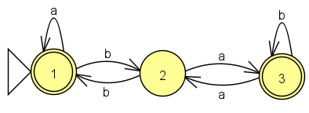
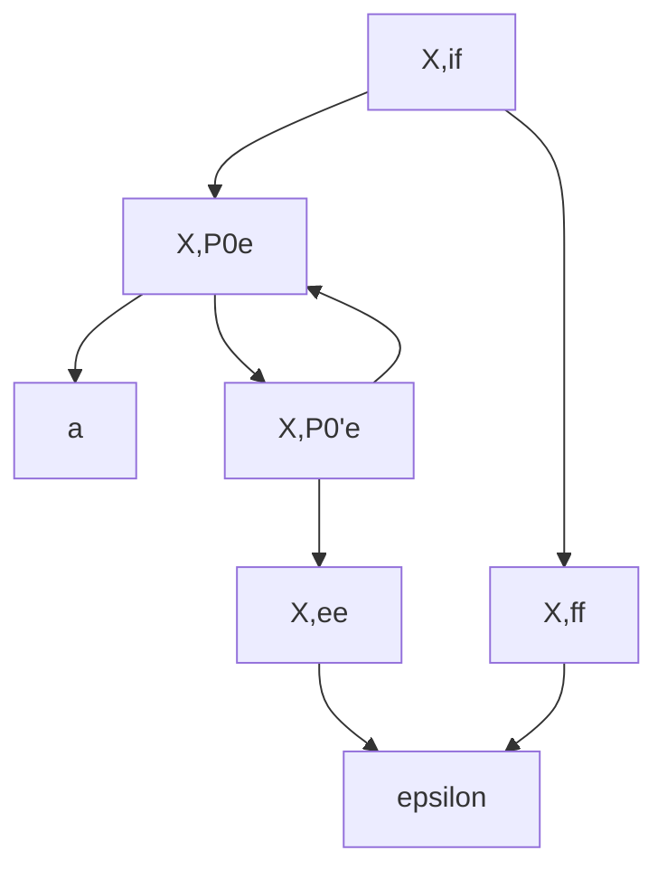

### Lemme de pompage régulier

Si $L$ est regulier alors $L$ satisfait la condition de pompage regulier  

c'est a dire :

- $\exists N>0 \space \forall w \in L \space |w|>N$

- $\exists x,y,z \space w=xyz, \space y\neq \epsilon$

- $\forall i \in \mathbb{N} \text{ on a } xy^iz \in L$

**Average Proof:**

$$
Soit \space N>0 \text{ Posons } w=... \text{ On a bien } w \in L \space et |w| >N\\
Soient \space x,y,z \space tq \space w=xyz,\space y\neq \epsilon \space et \space  |xy|<N\\
\text{Posons }i=...\\
.\\
.\\
\text{On a } xy^iz \notin L
$$

**Ex :**

Montrer que $L=\{ a^nb^mc^k \mid n\neq{m} \text{ ou } m\neq k\}$ n'est pas regulier.

**Preuve :**

$$
\bar{L} = ( \Sigma^{*} \backslash a^{*} b^{*} c^{*} ) \cup \{ a^n b^n c^n \mid n \ge 0 \} \\
\text{Montrons que }\bar{L} \text{ n'est pas regulier} (\overline{L} \text{ non régulier} \iff L \text{ non régulier})\\
et \space R=\{a^{*}b^{*}c^{*}\} \space regulier\\
\overline{L} \cap R = \{ a^n b^n c^n \mid n \ge 0 \} \text{ par distribution de l'} \cap \\
\text{Comme R est regulier , si } L' \text{ n'est pas régulier alors }\overline{L} \text{ n'est pas regulier} \\
\text{Prouvons que }L'=\{a^nb^nc^n\mid n >= 0\} \text{ n'est pas regulier}\\
Soit \space N>0 \text{ Posons } w=a^Nb^Nc^N \text{ On a bien } w \in L' \space et |w| >N\\
Soient \space x,y,z \space tq \space w=xyz,\space y\neq \epsilon \space et \space  |xy|<N\\
|xy|<N,\space y\in a^{*} et\space  y\neq \epsilon\\
\text{Posons }i=2\\
|xy^2z|_a = |x|_a + |y|_a + |y|_a + |z|_a = (|x|_a + |y|_a + |z|_a) + |y|_a\\
= |xyz|_a + |y|_a = N + |y|_a = N + |y|>N\\
|xy^2z|_b = N + |y|_b=N\\
\text{On a } xy^iz \notin L
$$

**Exo :**

Transformer ce Language en grammaire $L=\{a^ib^jc^k \mid i=j \text{ ou }j=k\}$

$L= \{a^ib^jc^k \mid i=j\}\cup \{a^ib^jc^k \mid j=k\}$

$L=\{a^ib^j \mid i=j\}. \{c^k \mid k>=0\} \cup ...$

$X \to aXb \mid \epsilon ,\space C \to cC\mid \epsilon\\S \to AC$

#finir

**Prop :**

Soient $G_1$ et $G_2$ deux grammaires. 

$\exists $ les grammaires :

- $G_\cup$ tq $L(G_\cup) = L(G_1) \cup L(G_2)$

- $G_.$ tq $L(G_.) = L(G_1) . L(G_2)$

- $G_*$ tq $L(G_*) = (L(G_1))^*$

**Preuve :**

On fixe $G_1=(V_1,\Sigma,R_1,S_1) \space et \space G_2=(V_2,\Sigma,R_2,S_2) \space avec \space V_1 \cap V_2 =\emptyset$

Soit $S \notin V_1 \cup V_2 $

On definit :

- $G_{\cup} =(V_1 \cup V_2 \cup \{ S\},\Sigma,R_1 \cup R_2 \cup \{S \to S_1,S-SS_2\},S)$
- $G_. =(V_1 \cup V_2 \cup \{ S\},\Sigma,R_1 \cup R_2 \cup \{S \to S_1S_2\},S)$
- $G_* =(V_1 \cup \{ S\},\Sigma,R_1 \cup \{S \to SS \mid \epsilon \},S)$

**Corollaire :**

Tout language regulier est génere par une grammaire 

**Preuve :**

base :

si $L=\empty $ alors $ G_\empty = S \to S$  
si $L=\{a\} $ pour $a\in \Sigma$ alors $ G_a = S \to a$

heredite:

Si $L=L_1 \cup L_2 \text{ ou } L=L_1 . L_2 \text{ ou } L=L_1^*$ consequece dde la prop precedente.

**Remarque :**

La reciproque est fausse : $S \to aSb \mid \epsilon$

---

**Prop :** 

$$
L \space regulier \iff \exists G \text{ est regulier a droite tq }L=\mathcal{L}(G)
$$

**Preuve :**

$ \implies :$

init : $S\to S \space et \space S\to a$

heredite: Soient $G_1(V_1,\Sigma,R_1,S_1)$ et $G_2(V_2,\Sigma,R_2,S_2)$ linéaires a droites.

il suffit de montrer $\exists$ :

- $G_\cup$ linéaire à droite tq $\mathcal{L}(G_\cup) = \mathcal{L}(G_1) \cup \mathcal{L}(G_2)$ 

- $G_.$ linéaire à droite  tq $\mathcal{L}(G_.) = \mathcal{L}(G_1) . \mathcal{L}(G_2)$

- $G_*$ linéaire à droite  tq $\mathcal{L}(G_*) = (\mathcal{L}(G_1))^*$

$G_\cup$ : $(S \to S_1\mid S_2)$  
$G_.$ :  
$S_1\to bX_1 \mid aS_1 ,X_1 \to bS_1\mid \epsilon$  
$S_2 \to ccS_2\mid c$  
donc $G_. = (\{ (vS_2) \mid v \in V_1\} \cup V_2,\Sigma,R_1^{()} \cup R_2,(S_1S_2))$  
avec $R^{()}= \{ (vS_2) \to ... \}$

$\impliedby :$

Si $G$ est lineaire a droite alors $\mathcal{L}(G)$ est regulier  
Soit $G=(V,\Sigma,R,S)$  
Il faut montre qu'il existe ue relation entre une regle de la grammaire et la construction de ca dans un automate.

Ex:

Nb binaire sans 0 non-significatif:  
$S\to 1X|0;X \to 1X|0X|\epsilon$

Expresion regulière sur $\{a,b\}$ :  
$E\to a|b|\emptyset|E+E|EE|E^*|(E)$

algo 1:

$\mathcal{A}$ ensemble des varriable accessible

base : $S \in \mathcal{A}$
regle : si $X \in \mathcal{A}$et $\exists \alpha,\beta,\gamma$ tq $X\to  \alpha\beta\gamma$ alors $Y \in \mathcal{A}$

---

**Proposition :**

Si $G$ est une grammaire alors il existe $G'$ tq $\mathcal{L}(G') = \overleftarrow{\mathcal{L}(G)}$

**Preuve :**

Soit $G=(V,\Sigma,R,S)$ On definit $G'=(V',\Sigma,R',S)$ où $R'=\{X \to \overleftarrow{\alpha}|X \to \alpha \in R \}$  
Montrons que $\mathcal{L}(G') = \overleftarrow{\mathcal{L}(G)}$ par recurence

$(P_n)$  $S \xrightarrow{n} \alpha \in G \iff S \xrightarrow{n} \overleftarrow{\alpha} \in G'$

init n=0: $S \xrightarrow{0} \alpha \in G \iff \alpha = S = \overleftarrow{S} \iff S \xrightarrow{0} \overleftarrow{\alpha} \in G'$  
heredite : Soit $n \geq 0$ Supposon $(P_n)$ vraie et montrons $(P_{n+1})$.

Supposons $S \xrightarrow{n+1} \alpha \in G$ alors $\exists \alpha_1,\alpha_2,\alpha_3$ tq $\alpha=\alpha_1\alpha_2\alpha_3,\space S \xrightarrow{n} \alpha_1X\alpha_3;\space X\to \alpha_2$  
Par récurence : $\space S \xrightarrow{n} \alpha_1X\alpha_3 \in G'$ et $X \to \overleftarrow{\alpha_2} \in G'$  
d'ou $S \xrightarrow{n+1} \overleftarrow{\alpha_1} \space \overleftarrow{\alpha_2} \space \overleftarrow{\alpha_3} = \overleftarrow{\alpha} \in G'$  
Pareil pour $\impliedby$ car le mirroir est involutif

**Definition :**

Soit $G=(V,\Sigma,R,S)$ une grammaire.  
Un arbre de derivation de $G$ est un arbre ordonné (dont les fils d'un meme pere sont ordonée) etiqueté par $V\cup\Sigma$ tq :

- la racine est ethiqueté par $S$
- les noeuds internes sont etiquetée par $V$
- les feuilles par $\Sigma \cup \{\epsilon\}$
- si $\alpha_1,\alpha_2,...,\alpha_r$ sont les etiquette des fils d'un noeud etiqueté par $X$ alors $X \to \alpha_1\alpha_2...\alpha_r$ est une regle

**Definition :**

La frontiere d'un arbre de derivation est le mot sur $\Sigma$ formé par les etiquette des feuilles prises dans l'ordre de visite d'un parcours préfixe.

**Proposition :**

$w$ est la frontiere d'un rabre de derivation de $G \text{ ssi } w \in \mathcal{L}(G)$ 

---

**Transformer un AEF en Grammaire linéaire a droite :**

$$
X_1 \to aX_1 | bX_2 | \epsilon\\
X_2 \to aX_3 | bX_1 \\
X_3 \to aX_2 | bX_3 | \epsilon\\
$$

---

**Definition :**  
Un automate à pile (non-deterministe)(APND) est un sixtuplet $(Q,\Sigma,\Gamma,\delta,I,F)$ avec :

- $Q$ est l'ensemble fini dont les élement sont apelle etat
- $I \subseteq Q$ appelé ensemble d'etat initiaux
- $F \subseteq Q$ appelé ensemble d'etat finaux
- $\Sigma$ alphabet appele alphabet d'entrée
- $\Gamma$ alphabet appele alphabet de pile
- $\delta \subseteq Q \times (\Sigma \cup \{\epsilon\}) \times (\Gamma \cup \{\epsilon\})$

Depuis $p$ lire $\sigma \in (\Sigma \cup \{\epsilon\})$, déplacer $\alpha \in (\Gamma \cup \{\epsilon\})$, empile $\beta \in (\Gamma \cup \{\epsilon\})$ entrer $q$.

**Definition :**
Une configuration d'un APND $(Q,\Sigma,\Gamma,\delta,I,F)$ est une paire dans $Q \times \Gamma^*$

- configuration initiale: $I \times \{\epsilon\}$
- configuration finale: $F \times \Gamma^*$

Exemple : $\boxed{p,12112}$

**Definition :**
$\delta$ induit une collection sur les configuration indexe par $\Sigma \cup \{\epsilon\} : \boxed{p,u} \space \xrightarrow{\sigma} \space \boxed{q,v}$

Si $(p,\sigma,\alpha,\beta,q) \in \delta$ et $\exist w \space tq \space u=w\alpha; \space v=w\beta$

On etand $\xrightarrow{\sigma}$ à $\xrightarrow{w}$ pour $w \in \Sigma^*$

Base: $\boxed{p,u} \space \xrightarrow{\epsilon} \space \boxed{q,v}; \space \forall p \in Q,\forall u \in \Gamma^*$
Regle: si $\boxed{p,u} \space \xrightarrow{x} \space \boxed{q,v}$ et $\boxed{q,v} \space \xrightarrow{\sigma} \space \boxed{r,w}$ alors $\boxed{p,u} \space \xrightarrow{x\sigma} \space \boxed{r,w}$

**Definition :**
$w\in \Sigma^*$ est accepte par l'APND si il existe $\boxed{q_i,\epsilon}$ une configuration initiale et $\boxed{q_f,\epsilon}$ un conf finale tq $\boxed{q_i,\epsilon} \xrightarrow{w} \boxed{q_f,\epsilon}$ .  
Le language reconu par l'APND est l'ensemble des mot acceptés

---

$L=\{a^nb^{n+k} | n,k\geq0\}$

$L=\{a^{n+k}b^n | n,k\geq0\}$

---

**Theoreme :**

Soit $L \subseteq \Sigma^*$,$L$ est genere pas une grammaire hors contexte ssi $L$ est reconnu par un automate a pile non deterministe.

**Def :**

un APND $A=(Q,\Sigma,\Gamma,\delta,I,F)$ est en forme normale du cours si:

- il y a un unique etat initial i ($I=\{i\}$)

- il y a un unique etat final f ($F =\{f\}$)

- tout calcul acceptant termine avec la pile vide.

- les transition sont atomiques,c'est a dire font exacteme,nt une action parmi lire, deplier et empiler.

aaabb

etat: $i \to P_0 \to P_01 \to P_0 \to P_01 \to P_0 \to P_01 \to P_0 \to P_11 \to P_1 \to P...$
pile:  $\epsilon \to Z \to Z1 \to Z11 \to Z111 \to Z11 \to Z1 \to Z \to \epsilon$

$G=(V,\Sigma,R,S)$ avec $V=\{X_{p,q}|p,q \in Q\}$.  
but : $X_{p,q} \to^* w \in \Sigma^*$ ssi depuis $\boxed{p,\epsilon}$ on peu rejoindre $\boxed{q,\epsilon}$ en lisant $w$.

$R$: depuis $X_{p,q}$:

- $X_{p,q} \to \epsilon$ si $p=q$

- $X_{p,q} \to aX_{r,q}$ si il existe une a transition de $p$ à $r$.

- $X_{p,q} \to X_{r,s}$ si $p\xrightarrow{\epsilon,\epsilon,x}r $ et $ s\xrightarrow{\epsilon,x,\epsilon}t$

**Def :** Forme normal de Chomsky

Une grammaire hors contexte $(V,\Sigma,R,S)$ est un FNC si:

- La grammaire est reduite.

- $X \to \alpha \in R$ alors 
  
  - Soit $\alpha \in (V \backslash \{S\})^2$ $(X \to YZ \text{ avec }Y\neq S \space et \space Z \neq S)$
  
  - Soit $\alpha \in \Sigma$ $(X \to a)$
  
  - Soit $\alpha = \epsilon \space et \space X=S$ $(S \to \epsilon)$ 

**Propriete :** Toute GHC est equivalente a une GHC en FNC

$$
S \to TE|\epsilon\\
E\to TE | PA \\
P \to + \\
A \to a \\
T \to AT | a | b \\
$$

**Prop :**

Soit $\alpha \in V^* \space \alpha \xrightarrow{*}u\beta$ par une derivation a gauche ssi $(m,\overleftarrow{\alpha} \xrightarrow{u} m,\overleftarrow{\beta})$

$$
E \to E+E | E\times E | (E) | N\\
N \to 0|1C\\
C \to 0C|1C|\epsilon
$$