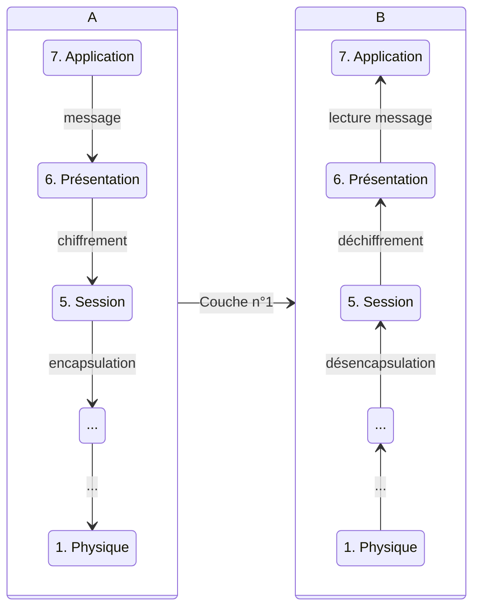

# Plan

- [Modèle en couches](#modele_en_couche)
- [Protocole IP](#protocol_ip)
- Protocole TCP
- Protocole UDP
- Routage (Interne)
- ICMP
- DHCP/NAT

# Modèles en couches {#modele_en_couche}

Modèle introduit par l'ISO -> OSI (Open Systems Interconnection)

Le modèle **OSI** est théorique (recommandation).

7 couches pour dialoguer entre plusieurs machines de natures différentes sur un même réseau.

## 7 Couches (du plus abstrait au plus rationnel)

- 7\. Application
- 6\. Présentation
- 5\. Session
- 4\. Transport
- 3\. Réseau
- 2\. Liaison
- 1\. Physique

> Dans ce cours (Réseau I), on va se focaliser sur le transport et le réseau.

>[!hint] Info
>
> **X.25** est le seul protocole à respecter toutes les règles de l'OSI.
### 7. Application

Navigateur web / mail
 HTTP, etc.

### 6. Présentation

Modification des données -> chiffrement

### 5. Session

RPC :
: Remote Procedure Call

PPTP :
: Point-to-Point Tunneling Protocol

PAP :
: Password Authentication Protocol

### 4. Transport

TCP / UDP

UDP est utilisé dans le streaming et le jeu vidéo.
TCP est plus utilisé dans le web.

> La notion de port va être abordée.

### 3. Réseau

**IP** : *Internet Protocol* 
- IPv4
- IPv6

**Adresse IP** (Adresse logique)

### 2. Liaison

Adressage physique
Protocole d'accès au média

MAC :
: Media Access Control 
  - codé sur 48 bits en hexadécimal
  - identifiant unique.

### 1. Physique

- Réseau Ethernet
- Wi-Fi
- 4G / 5G

| A | | B |
|---|---|---|
| 6 | -> | 6 |
| 7 | -> | 7 |
| 5 | -> | 5 |
| 4 | -> | 4 |
| 3 | -> | 3 |
| 2 | -> | 2 |
| 1 | -> | 1 |

**A** veut communiquer avec **B**. La couche envoyée doit être la même que celle reçue.

## Fonctionnement

Encapsulation / Désencapsulation
Multiplexage / Démultiplexage

Avant d'encapsuler, on passe à la couche en dessous.

Quand on encapsule, on ajoute des informations :
- Le protocole de chiffrement, etc.

**A :**

En couche 1, on peut envoyer les informations de A à B (physiquement).

B reçoit les informations et désencapsule jusqu'à la couche désirée grâce aux informations ajoutées pendant la phase d'encapsulation.

## Avantages

Modularité au niveau des protocoles.

**Ex** : Ajouter un nouveau moyen de communication nécessite uniquement de modifier la couche n° 1.

## Inconvénients

La taille des messages est plus importante (surcoût dû aux en-têtes).

# IP Internet Protocol {#protocol_ip}

> **Internet = le Reseaux des Reseaux**

## Plan:

- But du protocol IP
- Adressages Logique ,Classe d'Adresse
- Structure des Paquets(Datagrame IP)
- Fragmentation
- Principe du Routage

## IP (Couche n°3)

Le but est de permettre l'interconnexion avec plusieurs réseaux de natures différentes.

**Plusieurs caractéristiques :**

- Adressage logique
- Une façon de router / acheminer les paquets 
- La remise de paquets

### Adressage Logique :

- **IPv4** : 
  - **32 bits** avec un découpage variable en deux pour différencier le réseau de la machine.
  - **Notation pointée** : 192.110.2.37

- **IPv6** : 
  - **128 bits** dont les 64 premiers pour le réseau et les 64 derniers pour la machine.
  - **Notation hexadécimale** : 2001:0db8:0000:0000:8a2e:0000:0370:7334