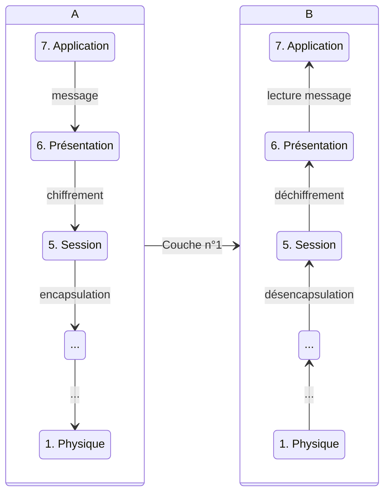
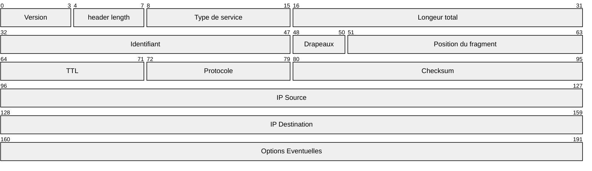
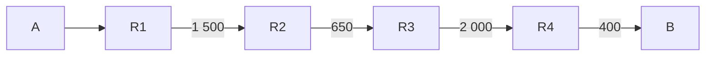

# Plan

- [Modèle en couches](#modles-en-couches)
- [Protocole IP](#ip-internet-protocol)
- Protocole TCP
- Protocole UDP
- Routage (Interne)
- ICMP
- DHCP/NAT

# Modèles en couches

Modèle introduit par l'ISO -> OSI (Open Systems Interconnection)

Le modèle **OSI** est théorique (recommandation).

7 couches pour dialoguer entre plusieurs machines de natures différentes sur un même réseau.

## 7 Couches (du plus abstrait au plus rationnel)

- 7\. Application
- 6\. Présentation
- 5\. Session
- 4\. Transport
- 3\. Réseau
- 2\. Liaison
- 1\. Physique

> Dans ce cours (Réseau I), on va se focaliser sur le transport et le réseau.

> [!hint] Info
> 
> **X.25** est le seul protocole à respecter toutes les règles de l'OSI.

### 7. Application

Navigateur web / mail
 HTTP, etc.

### 6. Présentation

Modification des données -> chiffrement

### 5. Session

RPC :
: Remote Procedure Call

PPTP :
: Point-to-Point Tunneling Protocol

PAP :
: Password Authentication Protocol

### 4. Transport

TCP / UDP

UDP est utilisé dans le streaming et le jeu vidéo.
TCP est plus utilisé dans le web.

> La notion de port va être abordée.

### 3. Réseau

**IP** : *Internet Protocol* 

- IPv4
- IPv6

**Adresse IP** (Adresse logique)

### 2. Liaison

Adressage physique
Protocole d'accès au média

MAC :
: Media Access Control 

- codé sur 48 bits en hexadécimal
- identifiant unique.

### 1. Physique

- Réseau Ethernet
- Wi-Fi
- 4G / 5G

| A   |     | B   |
| --- | --- | --- |
| 6   | ->  | 6   |
| 7   | ->  | 7   |
| 5   | ->  | 5   |
| 4   | ->  | 4   |
| 3   | ->  | 3   |
| 2   | ->  | 2   |
| 1   | ->  | 1   |

**A** veut communiquer avec **B**. La couche envoyée doit être la même que celle reçue.

## Fonctionnement

Encapsulation / Désencapsulation
Multiplexage / Démultiplexage

Avant d'encapsuler, on passe à la couche en dessous.

Quand on encapsule, on ajoute des informations :

- Le protocole de chiffrement, etc.

**A :**

En couche 1, on peut envoyer les informations de A à B (physiquement).

B reçoit les informations et désencapsule jusqu'à la couche désirée grâce aux informations ajoutées pendant la phase d'encapsulation.

## Avantages

Modularité au niveau des protocoles.

**Ex** : Ajouter un nouveau moyen de communication nécessite uniquement de modifier la couche n° 1.

## Inconvénients

La taille des messages est plus importante (surcoût dû aux en-têtes).

# IP Internet Protocol

> **Internet = le Reseaux des Reseaux**

## Plan:

- But du protocol IP
- Adressages Logique ,Classe d'Adresse
- Structure des Paquets(Datagrame IP)
- Fragmentation
- Principe du Routage

## IP (Couche n°3)

Le but est de permettre l'interconnexion avec plusieurs réseaux de natures différentes.

**Plusieurs caractéristiques :**

- Adressage logique
- Une façon de router / acheminer les paquets 
- La remise de paquets

## Adressage Logique :

### IPv4 :

**Notation pointée** : 192.110.2.37

**32 bits** avec un découpage variable en deux pour différencier le réseau de la machine.

Au depart le protocole prevoit 5 classe d'adresse A,B,C,D,E :

| Classe | Bits de debut | Plage du 1 octet | decoupage (hote / reseaux) | Nb de reseaux max | Nb de machine par reseaux |
|:------:|:-------------:|:----------------:|:--------------------------:|:-----------------:|:-------------------------:|
| A      | 0...          | 1 à 126          | 8/24                       | 256               | 16 000 000                |
| B      | 10...         | 128 à 191        | 16/16                      | 16 000            | 16 000                    |
| C      | 110...        | 192 à 223        | 24/8                       | 16 000000         | 256                       |
| D      | 1110...       | 224 à 239        | Multicast                  | -                 | -                         |
| E      | 1111...       | 240 à 255        | Experimental               | -                 | -                         |

Quand la parite machine contient que des 0 c'est l'adresse du reseaux

Adresse de broadcast , tout les bits sont a 1.

**Ex :**

**IP** 2.43.5.6 appartient a la classe A

Reseaux 2.0.0.0

Broadcast 2.255.255.255

**Adresses speciales:**

- 0.0.0.0 toutes les adresses

- 255.255.255.255 Brodcast universel

- 127.0.0.1 Loopback : local host

**Adresse reseaux prive:**

- 10.0.0.0 à 10.255.255.254

- 172.16.0.0 à 172.31.255.254

- 169.254.0.0 à 169.255.255.254

- 192.168.0.0 à 192.168.255.254

### IPv6 :

**128 bits** dont les 64 premiers pour le réseau et les 64 derniers pour la machine.

**Notation hexadécimale** : 2001:0db8:0000:0000:8a2e:0000:0370:7334

## Structure d'un paquet IP / Datagramme IP

**Type de services :**

Peut etre ignoré par les routeurs

3 bits:

- D : delai d'acheminement cours

- T : Débit de transmission elevé

- R : Grande fiabilite

Taille max d'un datagramme IP est $2^{16} \approx 65 535$octets

Taille min : 20 octets

## Fragmentation :

Lorsqu' un paquet va de A a B il peut traverser plusieur reseaux physiques avec des MTU : Maximum Trasfer Unit taille max d'info dans un paquet qui peut etre transporté sur un reseaux physique (Ethernet $\approx$ 1 500 octets).

3 parametre utile:

- Identifiant

- Deplacment Fragment

- Drapeaux More fragment

Si le message $m$ de A à B fait 1 800 octets avec en-tete sans option (header :20 oct 1 780 data)

A envoie le message à B, le premier reseaux traverse est "Reseaux 1"

A vas decouper le paquet IP en plusieur morceaux pour le resaux 1 on peut decouper $m$ en $m_1$et $m_2$

Je decoupe est sequentiel : 

$m_1$ contient le debut de la donné

$m_2$ contient la fin de la donné

$m_1$ sur R2 doit etre decoupe en 3 morceaux

Identifiant unique entre IP(A) et IP(B) , quand on fragmente un pquet les ID restent les memes 

Deplacement fragement

Drapeaux more fragment =1 si d'autre Fragment ensuite:

- $m_1$ header : 20oct, data : 1 480oct MF : 1 Dep_frag : 0

- $m_2$ header : 20oct, data : 300oct MF : 0 Dep_frag : 1 480 

---

Pour le rassemblage : intervient uniquement sur la machine destinataire. Les fragments peuvent emprunter des chemins different et attendre que tous les fragment soient disponible sur le meme routeur retarderai la communication.

Sur la machine destinataire à partir du moment ou B recoit un premier fragment B arme un temposrisateur .
Si au bout du temps imparti tous les fragments ne sont pas arrivé,il détruit le paquet, puis il envoie un message d'erreur ICMP à l'expediteur.

L'ordre de la reception sur B des paquets et des fragment n'est pas garanti.

**Drapeaux particulier :** DNF (Do Not Fragment) commande stricte indique au roteur de ne pas fragmenter.

Si DNF est mis à 1 et que al taille du paquet ,est plus grand que le MTU le routeur en charge détruit le paquet et envoie un message d'erreur ICMP.

## Principe du Routage :

Les reseaux sont interconnecte par des equipement speciaux appele Routeurs. Les routeurs ont une adresse IP par reseaux auquel ils sont connectés.

Pour acheminer un paquet Ip on differencie le niveau Direct et Indirect

Remise direct A et B sont sur le meme Réseau , on utilise ARP ( Adresse Resolution Protocol) qui utilise l'adresse MAC.

Si A et B ne sont pas sur le meme reseau déterminer l'adresse reseau de B et de choisir le routeur le plus approprié.

Au niveau des routeur pour chaque paquet recus il faut determiner le routeur suivant . Chaque routeur a une table de routage valide.

**R1 :**

| Reseaux | Routeur |
| ------- | ------- |
| I       | 0.0.0.0 |
| II      | 0.0.0.0 |
| III     | R2      |
| IV      | R8      |
| V       | R4      |
| VI      | R4      |

Les routeur travaille jusqu'à la couche 3