# Plan

- [Modèle en couches](#modles-en-couches)
- [Protocole IP](#ip-internet-protocol)
- [Protocole UDP](#udp-user-datagram-protocol-)
- [Protocole TCP](#tcp-transmission-control-protol-)
- Routage (Interne)
- ICMP
- DHCP/NAT

# Modèles en couches

Modèle introduit par l'ISO -> OSI (Open Systems Interconnection)

Le modèle **OSI** est théorique (recommandation).

7 couches pour dialoguer entre plusieurs machines de natures différentes sur un même réseau.

## 7 Couches (du plus abstrait au plus rationnel)

- 7\. Application
- 6\. Présentation
- 5\. Session
- 4\. Transport
- 3\. Réseau
- 2\. Liaison
- 1\. Physique

> Dans ce cours (Réseau I), on va se focaliser sur le transport et le réseau.

> **X.25** est le seul protocole à respecter toutes les règles de l'OSI.

### 7. Application

Navigateur web / mail  
HTTP, etc.

### 6. Présentation

Modification des données -> chiffrement

### 5. Session

**RPC :**  Remote Procedure Call

**PPTP :** Point-to-Point Tunneling Protocol

**PAP :** Password Authentication Protocol

### 4. Transport

TCP / UDP

UDP est utilisé dans le streaming et le jeu vidéo.
TCP est plus utilisé dans le web.

> La notion de port va être abordée.

### 3. Réseau

**IP** : *Internet Protocol* 

- IPv4
- IPv6

**Adresse IP** (Adresse logique)

### 2. Liaison

Adressage physique
Protocole d'accès au média

**MAC :** Media Access Control 

- codé sur 48 bits en hexadécimal
- identifiant unique.

### 1. Physique

- Réseau Ethernet
- Wi-Fi
- 4G / 5G

| A   |     | B   |
| --- | --- | --- |
| 6   | ->  | 6   |
| 7   | ->  | 7   |
| 5   | ->  | 5   |
| 4   | ->  | 4   |
| 3   | ->  | 3   |
| 2   | ->  | 2   |
| 1   | ->  | 1   |

**A** veut communiquer avec **B**. La couche envoyée doit être la même que celle reçue.

## Fonctionnement

Encapsulation / Désencapsulation
Multiplexage / Démultiplexage

Avant d'encapsuler, on passe à la couche en dessous.

Quand on encapsule, on ajoute des informations :

- Le protocole de chiffrement, etc.

**A :**

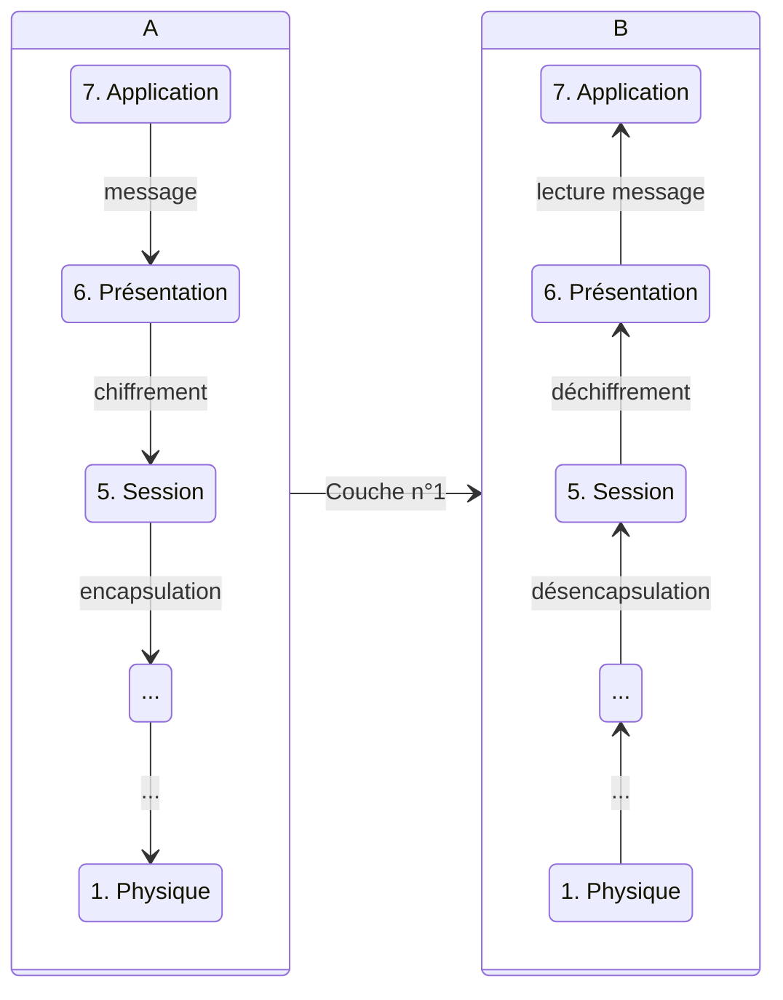
```mermaid
stateDiagram-v2

    direction LR

    state "A" as PartieA {
        direction TB

        state "7. Application" as appA
        state "6. Présentation" as presA
        state "5. Session" as sessA
        state "..." as nextA
        state "1. Physique" as c1

        appA --> presA : message
        presA --> sessA : chiffrement
        sessA --> nextA : encapsulation
        nextA --> c1 : ...

    }

    state "B" as PartieB {
        direction BT 

        state "1. Physique" as c1b
        state "..." as nextB
        state "5. Session" as sessB
        state "6. Présentation" as presB
        state "7. Application" as appB

        c1b --> nextB : ...
        nextB --> sessB : désencapsulation
        sessB --> presB : déchiffrement
        presB --> appB : lecture message
    }

    PartieA-->PartieB : Couche n°1
```

En couche 1, on peut envoyer les informations de A à B (physiquement).

B reçoit les informations et désencapsule jusqu'à la couche désirée grâce aux informations ajoutées pendant la phase d'encapsulation.

## Avantages

Modularité au niveau des protocoles.

**Ex** : Ajouter un nouveau moyen de communication nécessite uniquement de modifier la couche n° 1.

## Inconvénients

La taille des messages est plus importante (surcoût dû aux en-têtes).

# IP Internet Protocol

> **Internet = le Reseaux des Reseaux**

## Plan:

- But du protocol IP
- Adressages Logique ,Classe d'Adresse
- Structure des Paquets(Datagrame IP)
- Fragmentation
- Principe du Routage

## IP (Couche n°3)

Le but est de permettre l'interconnexion avec plusieurs réseaux de natures différentes.

**Plusieurs caractéristiques :**

- Adressage logique
- Une façon de router / acheminer les paquets 
- La remise de paquets

## Adressage Logique :

### IPv4 :

**Notation pointée** : 192.110.2.37

**32 bits** avec un découpage variable en deux pour différencier le réseau de la machine.

Au depart le protocole prevoit 5 classe d'adresse A,B,C,D,E :

| Classe | Bits de debut | Plage du 1 octet | decoupage (hote / reseaux) | Nb de reseaux max | Nb de machine par reseaux |
|:------:|:-------------:|:----------------:|:--------------------------:|:-----------------:|:-------------------------:|
| A      | 0...          | 1 à 126          | 8/24                       | 256               | 16 000 000                |
| B      | 10...         | 128 à 191        | 16/16                      | 16 000            | 16 000                    |
| C      | 110...        | 192 à 223        | 24/8                       | 16 000000         | 256                       |
| D      | 1110...       | 224 à 239        | Multicast                  | -                 | -                         |
| E      | 1111...       | 240 à 255        | Experimental               | -                 | -                         |

Quand la parite machine contient que des 0 c'est l'adresse du reseaux

Adresse de broadcast , tout les bits sont a 1.

**Ex :**

**IP** 2.43.5.6 appartient a la classe A

Reseaux 2.0.0.0

Broadcast 2.255.255.255

**Adresses speciales:**

- 0.0.0.0 toutes les adresses

- 255.255.255.255 Brodcast universel

- 127.0.0.1 Loopback : local host

**Adresse reseaux prive:**

- 10.0.0.0 à 10.255.255.254

- 172.16.0.0 à 172.31.255.254

- 169.254.0.0 à 169.255.255.254

- 192.168.0.0 à 192.168.255.254

### IPv6 :

**128 bits** dont les 64 premiers pour le réseau et les 64 derniers pour la machine.

**Notation hexadécimale** : 2001:0db8:0000:0000:8a2e:0000:0370:7334

## Structure d'un paquet IP / Datagramme IP

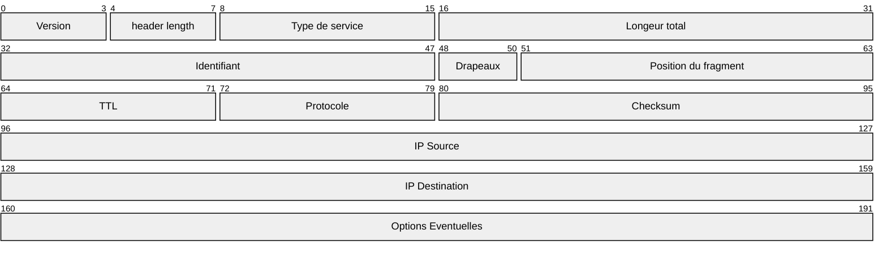
```mermaid
packet
+4:"Version"
+4:"header length"
+8:"Type de service"
+16:"Longeur total"
+16:"Identifiant"
+3:"Drapeaux"
+13:"Position du fragment"
+8:"TTL"
+8:"Protocole"
+16:"Checksum"
+32:"IP Source"
+32:"IP Destination"
+32:"Options Eventuelles"
```

**Type de services :**

Peut etre ignoré par les routeurs

3 bits:

- D : delai d'acheminement cours

- T : Débit de transmission elevé

- R : Grande fiabilite

Taille max d'un datagramme IP est $2^{16} \approx 65 535$octets

Taille min : 20 octets

## Fragmentation :

Lorsqu' un paquet va de A a B il peut traverser plusieur reseaux physiques avec des **MTU**(Maximum Transfer Unit): taille max d'info dans un paquet qui peut etre transporté sur un reseaux physique (Ethernet $\approx$ 1 500 octets).

3 parametre utile:

- Identifiant
- Deplacment Fragment
- Drapeaux More fragment

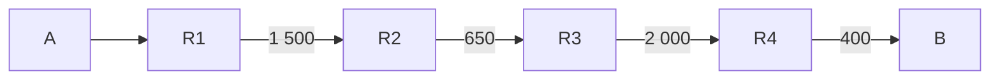
```mermaid
graph LR
A-->R1 
R1--1 500-->R2
R2--650-->R3
R3--2 000-->R4
R4--400-->B
```

Si le message $m$ de A à B fait 1 800 octets avec en-tete sans option (header :20 oct 1 780 data)
A envoie le message à B, le premier reseaux traverse est "Reseaux 1"
A vas decouper le paquet IP en plusieur morceaux pour le resaux 1 on peut decouper $m$ en $m_1$et $m_2$

Je decoupe est sequentiel : 

$m_1$ contient le debut de la donné
$m_2$ contient la fin de la donné
$m_1$ sur R2 doit etre decoupe en 3 morceaux

Identifiant unique entre IP(A) et IP(B) , quand on fragmente un pquet les ID restent les memes 

Deplacement fragement

Drapeaux more fragment =1 si d'autre Fragment ensuite:

|                        | $m_1$ | $m_2$ |
| ---------------------- | ----- | ----- |
| En-tete                | 20    | 20    |
| Données                | 1480  | 300   |
| Drapeaux more fragment | 1     | 0     |
| Deplacement fragment   | 0     | 1480  |

---

Pour le rassemblage : intervient uniquement sur la machine destinataire. Les fragments peuvent emprunter des chemins different et attendre que tous les fragment soient disponible sur le meme routeur retarderai la communication.

Sur la machine destinataire à partir du moment ou B recoit un premier fragment B arme un temposrisateur .
Si au bout du temps imparti tous les fragments ne sont pas arrivé,il détruit le paquet, puis il envoie un message d'erreur ICMP à l'expediteur.

L'ordre de la reception sur B des paquets et des fragment n'est pas garanti.

**Drapeaux particulier :** DNF (Do Not Fragment) commande stricte indique au roteur de ne pas fragmenter.

Si DNF est mis à 1 et que la taille du paquet ,est plus grand que le MTU le routeur en charge détruit le paquet et envoie un message d'erreur ICMP.

## Principe du Routage :

Les reseaux sont interconnecte par des equipement spéciaux appele Routeurs. Les routeurs ont une adresse IP par reseaux auquel ils sont connectés.

Pour acheminer un paquet Ip on differencie le niveau Direct et Indirect

Remise direct A et B sont sur le meme Réseau , on utilise ARP ( Adresse Resolution Protocol) qui utilise l'adresse MAC.

Si A et B ne sont pas sur le meme reseau déterminer l'adresse reseau de B et de choisir le routeur le plus approprié.

Au niveau des routeur pour chaque paquet recus il faut determiner le routeur suivant . Chaque routeur a une table de routage valide.

**R1 :**

| Reseaux | Routeur |
| ------- | ------- |
| I       | 0.0.0.0 |
| II      | 0.0.0.0 |
| III     | R2      |
| IV      | R8      |
| V       | R4      |
| VI      | R4      |

Les routeur travaille jusqu'à la couche 3

Il es possible de definir des routeur par defaut.

## Notion Sous reseaux/ Sur reseaux:

Il y a 3 classes (A,B,C) qui sont utilisable pour un usage normal. Les separation sur la taille des reseaux est d'une grande amplitude .

Les réseaux de classe A ou B peuvent etre trop grand par rapport a l'usage que l'on en a, on partitionne donc ces reseaux en plus petit sous reseaux .

On va utiliser la partie adressage machine pour definir une notion de sous reseaux.

On peut utiliser un octet de la partie machine pour definir des sous reseaux : 2.X.0.0

2.1.0.0 : sous reseaux à part entier 
2.17.0.0 : sera different du sous reseaux

La partie consacree au sous réseaux est dans la partie adressage machine et la norme autorise d'utiliser n'importe quelle partie, en pratique on utilise des prefixe.
2.0.0.0/16

Chaque réseaux peut etre partitionner de manière différente 

Complexite de routage

Pour chaque adresse reseaux on doit avoir le masque de sous reseaux assosié, pour les classe A,B,C classiques:

- **A** 255.0.0.0

- **B** 255.255.0.0

- **C** 255.255.255.0

# UDP User Datagram Protocol :

Le but du protocole UDP est de permettre l'utilisation du reseaux au niveau utilisateur (Sans privilege particulier)

Un protocole "non contolé"

Chaque message est independant des autres (equivalent d'envoie de carte postale)

**Notion de Port :**  
La notion de port a du sens à l'echelle de la machine/station.
Cela permet d'identifier quel programme est concerné.

Quand un programme va utiliser le protocole UDP, il vas demander à l'OS de lui fournir un numero de port , il faut que se numero soit unique.

Les ports < 1024 sont réservé pas utilisable sans privilège particulier.

**Mode Client :**  
Un programme qui est connecte au reseaux et envoie une requete à une entite pour avoir un service.
Le client a besoin d'un numero de port mais pas nécéssairement de le choisir.

**Mode Serveur :**  
Un programme qui attend les demandes de communication et qui fournit un service.
Le serveur doit disposer d'un numero de port et ce numero doit pouvoir etre choisi.

Numero de port code sur 16bits.

Chaque message est envoye individuellement. L'ordre de remise n'a pas d'importance la livraison des données n'est pas garanti.

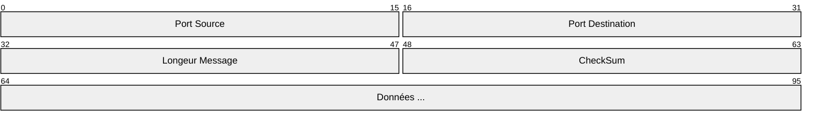
```mermaid
packet

+16: "Port Source"
+16: "Port Destination"
+16: "Longeur Message"
+16: "CheckSum"
+32: "Données ..."
```

Longueur du message en nombre total d'octets

La somme de control est calculé sur un pseudo-entête qui permet de verifier si le segment est valide ou corrompu. Si le message est ccorompu le systeme detruit le segment .

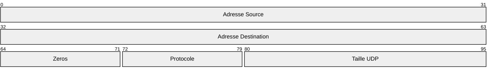
```mermaid
packet

+32:"Adresse Source"
+32:"Adresse Destination"
+8:"Zeros"
+8:"Protocole"
+16:"Taille UDP"
```

On peut ne pas renseigne le port source .

## Avantage :

- Protocol leger donc rapide
- Utile pour les usage où on peut se permettre des donnée (streaming video,Jeux video,rensfert de fichier)
- Fonctionent bien sur les reseaux locaux.

# TCP Transmission Control Protol :

- Remise fiable

- Propriete TCP

- Gestion du flux de donnes

- Format de segment TCP

TCP est un protocole orienté connexion  
Le but est d'etablir un circuit entre A et B.
La connexion TCP crée un flux de données de A vers B et de B vers A.(Flux bidirectionelle)

## Remise fiable V.0

Le principe est de s'assure que chaque morceau d'information trasmis est bien arrive à destination

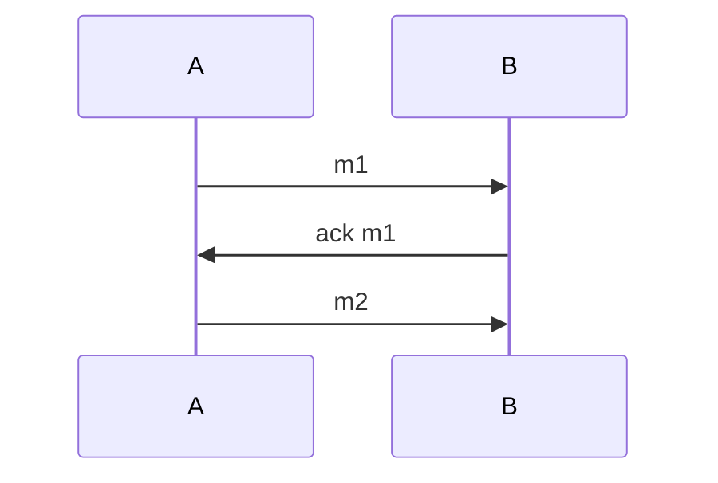
```mermaid
sequenceDiagram
    A->>B: m1
    B->>A: ack m1
    A->>B : m2
```

Chaque message $m_i$ envoyé par A à B fera l'objet de la part de B d'un acquitement (Acknolement) accusée de reception.

Si A recoit l'ACK de $m_i$ de la part de B, il Peut envoyer $m_{i+1}$

En cas de probleme :

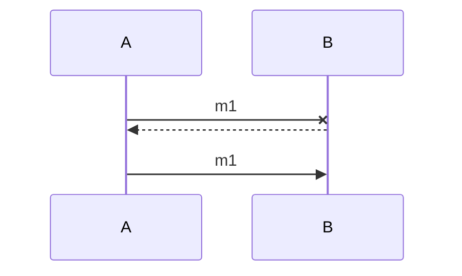
```mermaid
sequenceDiagram
    A-xB: m1
    B-->>A:
    A->>B : m1
```

Pour chaque envoie de message $m_i$ l'expediteur definit un delai pour recevoir l'aquitement, soit l'ACK arrive dans le delai impartie OK  
Soit l'ACK n'arrive pas ou arrive apres et dans ce cas A réxpedie$m_i$

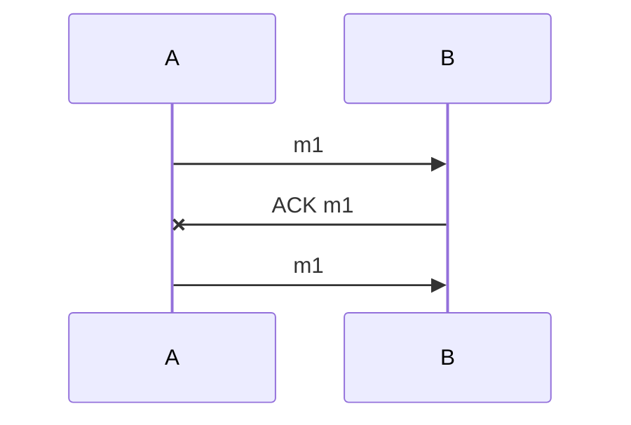
```mermaid
sequenceDiagram
    A->>B: m1
    B-xA: ACK m1
    A->>B : m1
```

Le probleme avec la V.0 est que l'on introduit beaucoup de latence.

**Fenetre glissate :**

On va fixer une valeur $k$.  
On autorise l'envoie de $k$ message avant d'attendre le premier ACK

**Ex :** $k=3$.

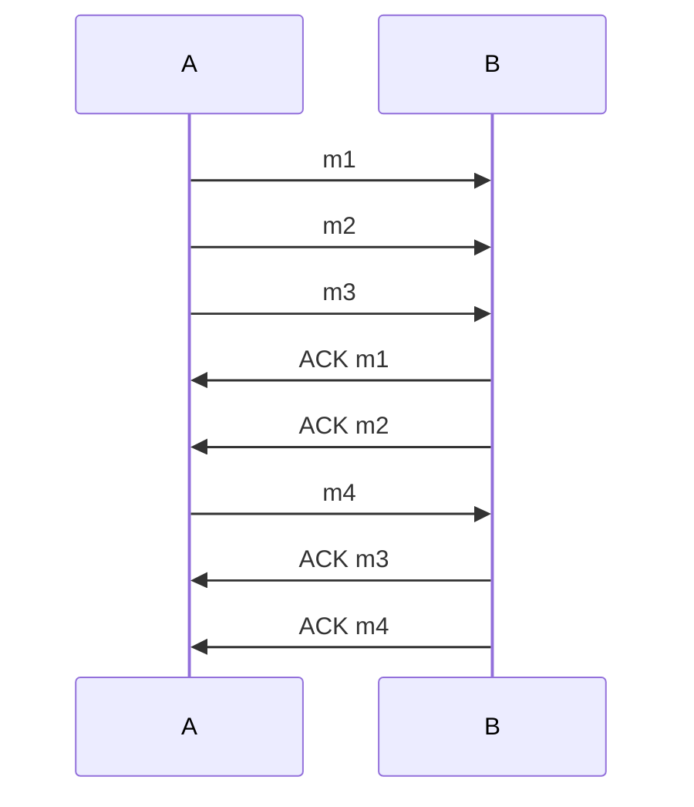
```mermaid
sequenceDiagram
    A->>B: m1
    A->>B: m2
    A->>B: m3
    B->>A: ACK m1
    B->>A: ACK m2
    A->>B: m4
    B->>A: ACK m3
    B->>A: ACK m4
```

**Notion Port TCP :**

Comme TCP est en mode connecte avec l'etablisemment d'un circuit Virtuel.  
Cote serveur: avoir uniquement un port public ne vas pas suffire pour cree des circuit.

En TCP, à chaque demande de connexion de la part d'une station, le serveur crée un nouveau Canal de communication.

**Au niveau du Client**, on cree un canal de communication (Socket), on fait une demande de connexion. Si la demande est accepte la communication peut ensuite avoir lieu sur ce canal.

**Cote Serveur**, Le serveur a un port public qui sert de point de rendez vous.  
Lorsque une connexion est demande il cree un canal special avec un numero de port dédie.

## Controle de Flux :

TCP peut adapter son taux d'emission et de reception.

Ce control se fait en faiant varier al taille de la fenetre glissante.  
Cette fenetre glissante est utilise sur un flot d'octet

1 2 3 [4 5 |6 7 8] 9 10 11 :

- [ : limite gauche

- ] : limite droite

- |: limite entre les octet deja envoye et en attente de confirmation et ce que l'on peut envoyer mais qui ne sont pas encore partie.

Tout ce qui est a gauche de la limite gauche de la limite a gauche sont des octets envoyés et deja acquités.  
Quand l'octet 4 est acquité, on peut faire glisser la fenetre à droite d'une unite.

Pour augmente le debit on va agrandir la taille de la fenetre glissante en augmentant la valuer de la limite droite.  
Tout les octet present dans la fenetre glissante ont le droit d'etre envoye et c'est irrevocable.

Reduire le debit: A chaque nouvel acquitement la limite gauche est augmente et la limite droite est maintenue.

On augmente le debit si la connexion le permet et on reduit si la connexion n'est pas suffisante

La taille de la plus petite fenetre est de 0 octet. La connexion est temporairement suspendu. Dans ce cas pour reprendre la communication, il faudrait passer par des donnée hors bande.

## Format de segment TCP

Le segment ou paquet TCP va permetre plusieur opération :

- Communiquer
- etablir une connexion.
- ...

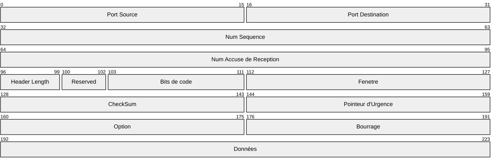
```mermaid
packet
+16 :"Port Source"
+16 :"Port Destination"
+32 :"Num Sequence"
+32 :"Num Accuse de Reception"
+4 :"Header Length"
+3 :"Reserved"
+9 :"Bits de code"
+16 :"Fenetre"
+16 :"CheckSum"
+16 :"Pointeur d'Urgence"
+16 :"Option"
+16 :"Bourrage"
+32 :"Données"
```

Bit de code :

- URG :Urgence , fenetre de la taille nulle

- ACK: Acuse de reception

- PSH: Push

- RST: Reset/ Re initailiser la connexion

- SYN: Synchronisation

- FIN: Fermeture de la connexion

Etablisemment de la connexion s'effectue en 3 étapes (three way handshake)

Premier message SYN positioné à 1  
Deuxieme message SYN + ACK (correspond à l'aquitement)  
Dernier message ACK pour informer que les partie sont d'accord.

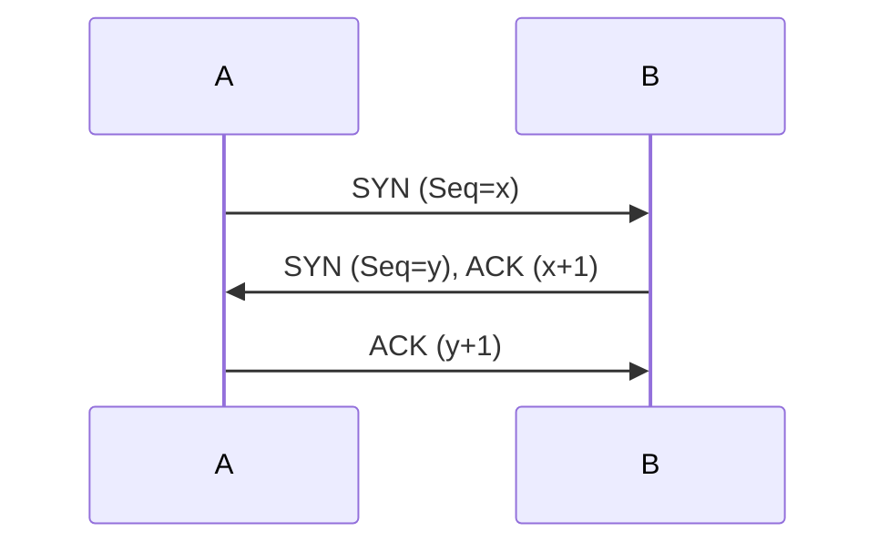
```mermaid
sequenceDiagram
A->>B : SYN (Seq=x)
B->>A : SYN (Seq=y), ACK (x+1)
A->>B : ACK (y+1)
```

A initie la demande de connexion.

Apres la reception du troisieme message,Les deux parties peuvent communiquer.

Une fois que la connexion a été etablie aucune nouvelle demande de connexion ser autorisé.

Pour la liberation de la Connexion , une fois que les programme ont terminé on peut libere la connexion.

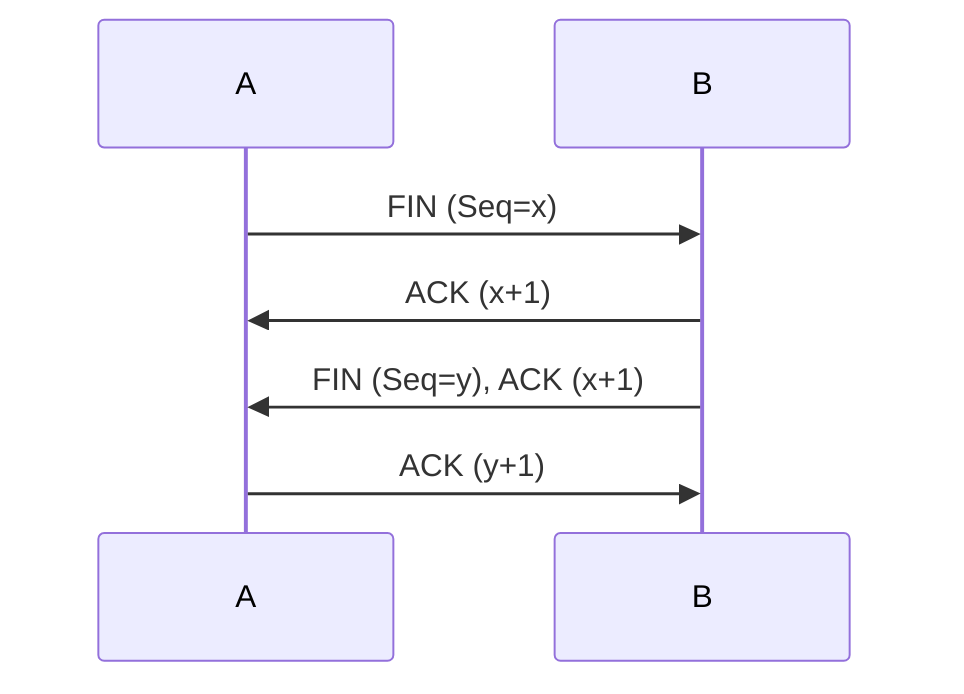
```mermaid
sequenceDiagram
A->>B: FIN (Seq=x)
B->>A: ACK (x+1)
B->>A: FIN (Seq=y), ACK (x+1)
A->>B: ACK (y+1)
```

Si un client n'a pas recus les données quil devait recevoir, le systeme d'exploitation qui gére TCP doit pouvoir fournir les eventuelles données manquante.  
Donc le systeme Conserve les ressource réseaux Active.

Il est possible que certaines communiquation soient réinitialisé une machine A ne repond plus , les messages envoyée par la machine n'ont aucun sens , l'autre machine peut demander la resiliation RST à 1.  
La communication est tout de suite interompu.

Notion Push:  
Par defaut pour limiter le gaspillage de bande passante ,le systeme attend d'avoir suffisament de données pour les envoyée.

Il y a des usages qui nécessitent d'etre reactif et de ne pas privilégier le débit.  
Dans le cas d'un service de communication en direct.

Terminaux distant ssh/ncftp, ca se precise en mettant le bit de code  PSH à 1.

Données Hors Bande si la taille de la fenetre passe à une taille 0. Il faut envoyer un message pour reprendre la communication.

Le bit URG est mis à 1, le pointeur d'urgence indique à quel endroit de l'en-tete regarder (ex :la taille de la fenetre).  
Une fois l'urgence traite le comportement sequentiel reprend.

Aquitement cumulatif: On envoie et recoit un flux de données au lieu d'acquité individuellement un message on peut en acquitté plusieur d'un seul coup.

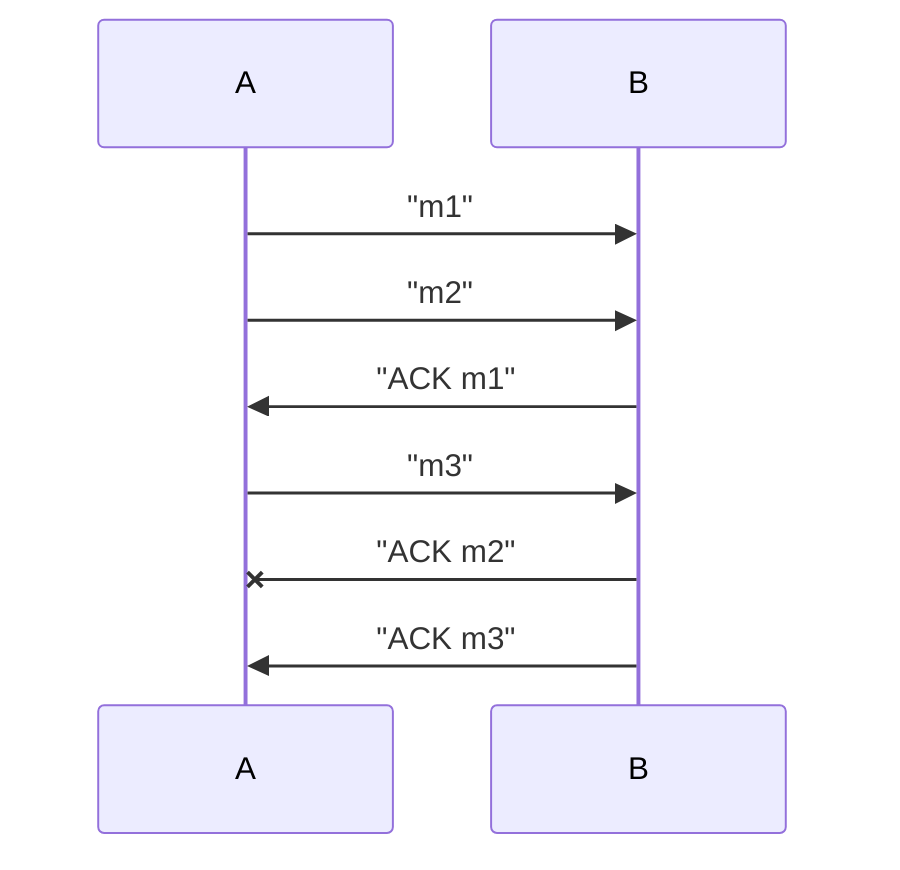
```mermaid
sequenceDiagram
A->>B:"m1"
A->>B:"m2"
B->>A:"ACK m1"
A->>B:"m3"
B-xA:"ACK m2"
B->>A:"ACK m3"
```

Si l'ACK de $m_3$ arrive dans les temps , alors il n'est pas nécessaire de renvoyer $m_2$

# Internet Control Message Protocol

Protocole d'erreur de IP, il se situe sur la couche 3.5:

- Mode de  fonctionement
- Types des messages

Les messages ICMP sont encapsulé dans des Datagramles IP. Le protocole est utilise pour la remonté d'erreur, la gestion, l'administration.

A chaque fois qu'un datagramme normal rencontre une erreur un message d'erreur ICMP sera envoyé. Par contre si les message d'erreur rencontre un probleme cela ne genere aucun message d'erreur.

La structure classique d'un message ICMP [entete|données].  
La structure des entete va dépendre du type de message envoyé

une partie commune :

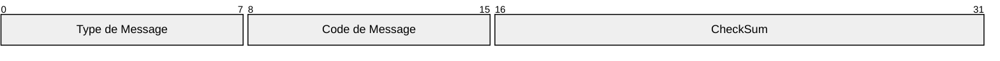
```mermaid
packet
+8:"Type de Message"
+8:"Code de Message"
+16:"CheckSum"
```

*Type de message :*

- 0 : Reponce a une demande d'echo

- 3 : Destination innacessible

- 4 : limitation de la production de la source

- 5 : Redirection (Changement de route)

- 8 : Demande d'echo

- 9 : Annoce de routeur

- 10 : Solicitaion de routeur

- 11 : Expiration delais data

- 12 : Probleme parametre data

- 13 : Demande d'horodatage

- 14 : Reponse d'horodatage

- 15 : Demande d'IP (remplacer par DHCP)

- 16 : Reponse d'IP(remplacer par DHCP)

- 17 : Demande de masque IP (Obsolete)

- 18 : Reponse de masque IP (Obsolete)

## 1

premier usage avec le ping. Ping envoie un message de demande d'echo(type 8), renvoie un message de reponse (type 0).  
Permet de tester si la couche 1,2 et 3 du destinataire fonctionnne. On peut ajouter des donnes arbitraire pour voir si elle sont altérées pendant le transport.

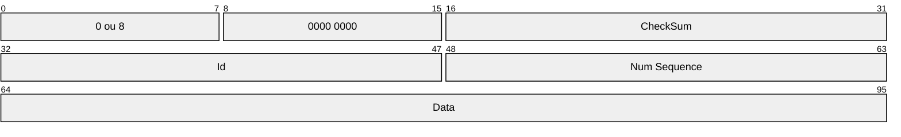
```mermaid
packet
+8:"0 ou 8"
+8:"0000 0000"
+16:"CheckSum"
+16:"Id"
+16:"Num Sequence"
+32:"Data"
```

## type 3

Type 3: Destination inaccessible lorsqu'un routeur n'est pas en messure de faire parvenir un datagramme à destination 

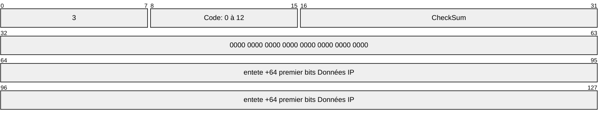
```mermaid
packet
+8:"3"
+8:"Code: 0 à 12"
+16:"CheckSum"
+32:"0000 0000 0000 0000 0000 0000 0000 0000"
+64:"entete +64 premier bits Données IP"
```

Code :

0. reseaux innacsessible (probleme de routage)

1. station innacsessible

2. protocole innaccessible

3. port inacsessible

4. fragment nessesasire et bit DF à 1

5. echec de routage de source

6. reseux de destination Inconnu

7. station de destination Inconnu

8. 

9. communication avec le reseaux de destination interdit pas l'admin

10. communication avec la station de destination interdit pas l'admin

## Type 4

Type 4:limition de la productionde la source. Indique que la station ou le routeur voisn a un debit trop eleve: reduire le debit, peut completement stopper l'envoie de données.  
Il n'existe pas de message de reprise 

## Type 5

Redirection lorsque le routeur recoit un datagramme mais qu il connait une meilleur route pour ce message

Code :

0. redirection de data pour le reseaux

1. redirection de data pour ordinateur

2. TOS

3. TOS + ordi

## Type 11

Expiration delais data ou route trop longue 

Code : 

0. TTL expire

1. Delai de re-assamblage d'un datagramme fragmente trop long

## Type 12

Probleme de parametre data detruit a caus ed'option incorrecte

Code 1: option obligatoire abscente,pointeur pour indiquer l'option problematique.

Code 0:option erroné

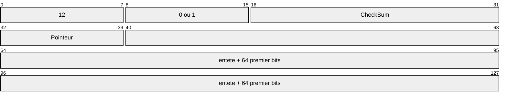
```mermaid
packet
+8:"12"
+8:"0 ou 1"
+16:"CheckSum"
+8:"Pointeur"
+24:" "
+64:"entete + 64 premier bits"
```

## Type 13/14

synchrohorloge et estimation

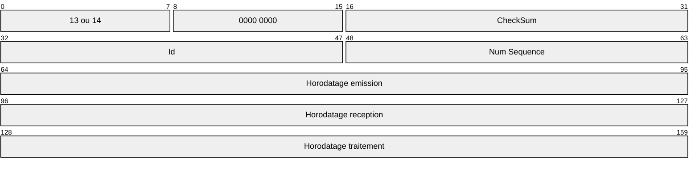
```mermaid
packet
+8:"13 ou 14"
+8:"0000 0000"
+16:"CheckSum"
+16:"Id"
+16:"Num Sequence"
+32:"Horodatage emission"
+32:"Horodatage reception"
+32:"Horodatage traitement"
```

13 Deamnde 
14 Reponse 

13 part uniquement avec horodatage emission(l'heure d'envoi)

14 il conserve l'horodatage d'emission de 13. Il rajoute immedaitement l'heure de reception sur B et (il ajoute ensuite l'heure juste avant de repondre: permet de synchroniser les horloge(peu precis).
permet d'estimer le temps d'A/R permet d'estimer la charge de travail du destinataire.

# Network Adress Translation

Au niveau de IPv4 on distingue 2 type d'adresse : Publique et Privées

Translation d'adresse classiques.

image

A demande de communiquer avec www.uca.fr. Pour repondre uca utilisera comme adresse destinataire 2.3.5.7 pour que le routeur sache  à qui est destiné le message il doit maintenir à jour une table de correspondance donnée.

| IP privée | IP public |
| --------- | --------- |
| 10.0.0.1  | 160.2.4.8 |

Il devra maintenir la table de Correspondance à jour.

On ne peut pas avoir deux machine du reseaux privee qui peuvent communiquer avec la meme machine extérieur.

Comme la plupart des communication passe par al couche transport, on peut utiliser le port et le protocole 

| IP privée | Port privée | Protocol | Port public | Destinataire Public | port destinataire public |
| --------- | ----------- | -------- | ----------- | ------------------- | ------------------------ |
| 10.0.0.1  | 2300        | TCP      | 16320       | www.uca.fr          | 1555                     |
| 10.0.0.2  | 2400        | TCP      | 2754        | www.uca.fr          | 7000                     |

Pour heberge un serveur ont peut configurer le routeru pour faire une association semi-permanente port forwarding