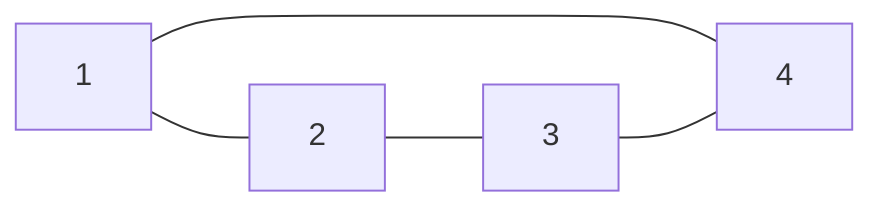
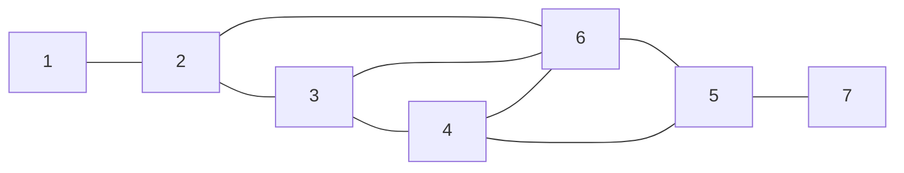

# Plan

- [def de base](#def)
- graphe bipartie
- decomposition en cycle
- tour euclidien
- Parcours de graphe
  - générique
  - en largeur
  - en profondeur
- couplage

# C'est quoi un graphe {#def}

Graphe :
: $G=(V,E)$ avec $V$ l'ensemble des sommets et $E$ l'ensemble des arêtes ,$E \subseteq  V \times V$

**Ex:** 

$G_1 = \left( \big\{1,2,3,4 \big\},\big\{\{1,2\},\{2,3\},\{3,4\},\{1,4\} \big\} \right)$

Arête :
: {1,2} 1->2 et 2->1

Arc :
: (a,b) a->b != (b->a)

Boucle:
: $\exist x \in V , \{x,x\} \text{ ou } (x,x) \in E$

Graphe simple :
: Graphe sans arête parallèle

## motivation

- Outils pour modéliser des problèmes de la vie réelle
- Outils théoriques puissants
- Minimisation de caméras (pour une galerie d'art)

## Approche 

- Vision algébrique
- Mathématique discrète Trouver des condition nessecaire et suffisante pour l'existence d'un objet

## Algorithme de résolution

Représentation d'un graphe:

- Matrice d'adjacence
- Liste d'adjacence

### Matrice d'adjacence

Dans un graphe à $n$ sommet l'espace mémoire utilisé est en $O(n^2)$
Le nombre max d'arêtes est de $\frac{n(n-1)}{2}$ il s'agit d'un graphe complet

### Liste d'adjacence
 
Liste de listes des voisins

1->[2]
2->[3,1,4]
3->[4,2]
4->[3,2]

$$d_G(x) = \left|\{w \mid \{w, x\} \in E(G)\}\right|$$
**Ex:** 

$d_G(2)=3,d_G(1)=1,d_G(3)=2$

$$n + \sum_{x \in V} d_G(x)$$
$$et$$
$$\sum_{x \in V} d_G(x) = 2m$$

$$\implies n+2m \in O(n+m)$$

Dans un graphe orienté on distingue les voisins entrants et sortants
on note:
- $d_G^+$ le nombre de voisins sortants 
- $d_G^-$ le nombre de voisins entrants

$$S(G) = \min \left\{ d_G(x)\mid x \in V(G) \right\} $$
$$\Delta(G) = \max \left\{ d_G(x)\mid x \in V(G) \right\} $$
$$N_G(v) =  \left\{w \mid \left\{v,w\right\} \in V(G)\right\}$$

On dit qu'un graphe est  $k-$regulier si tous les sommets ont des degrés identiques 

## Chemins et Cycles

Chemins : 
: $P = (v_1,v_2,v_3,...,v_k), \forall{i} \in{[1,k-1]},v_i \neq v_{i+1} \text{ et } {v_i,v_{i+1}}\in{E(G)}$

**Ex:** 

- $P_1 = (1,2,6,3,4,6,5,7)$ n'est pas un chemin élémentaire car il y a 2 fois le sommet 6
- $P_2 = (1,2,3,4,5,7)$ est un chemin
- $P_3 = (1,2,6,7)$ n'est pas un chemin élémentaire car l'arête {6,7} n'existe pas dans le graphe

Cycles:
: Un cycle est un chemin et $\{v_1,v_k\} \in{E(G)}$
