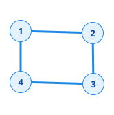
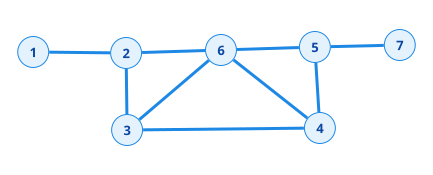
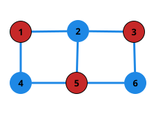
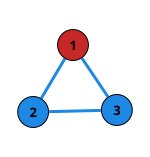
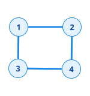
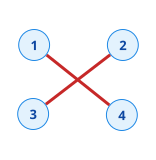
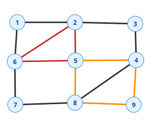

# Plan

- [def de base]()
- [graphe bipartie](#graphe-bipartie)
- [decomposition en cycle](#decomposition-en-cycle-)
- [tour euclidien]()
- Parcours de graphe
  - générique
  - en largeur
  - en profondeur
- couplage

# C'est quoi un graphe

***Graphe :***
&emsp; $G=(V,E)$ avec $V$ l'ensemble des sommets et $E$ l'ensemble des arêtes ,$E \subseteq  V \times V$

**Ex:** 

$G_1 = \left( \big\{1,2,3,4 \big\},\big\{\{1,2\},\{2,3\},\{3,4\},\{1,4\} \big\} \right)$



***Arête :***
&emsp; {1,2} 1->2 et 2->1

***Arc :***
&emsp; (a,b) a->b != (b->a)

***Boucle:***
&emsp; $\exist x \in V , \{x,x\} \text{ ou } (x,x) \in E$

***Graphe simple :***
&emsp; Graphe sans arête parallèle

## Motivation

- Outils pour modéliser des problèmes de la vie réelle
- Outils théoriques puissants
- Minimisation de caméras (pour une galerie d'art)

## Approche

- Vision algébrique
- Mathématique discrète<br>Trouver des condition nessecaire et suffisante pour l'existence d'un objet

## Algorithme de résolution

Représentation d'un graphe:

- Matrice d'adjacence
- Liste d'adjacence

### Matrice d'adjacence

Dans un graphe à $n$ sommet l'espace mémoire utilisé est en $O(n^2)$  
Le nombre max d'arêtes est de $\frac{n(n-1)}{2}$ il s'agit d'un graphe complet

### Liste d'adjacence

Liste de listes des voisins

1->[2]  
2->[3,1,4]  
3->[4,2]  
4->[3,2]  

$$
d_G(x) = \left|\{w \mid \{w, x\} \in E(G)\}\right|
$$

**Ex:** 

$d_G(2)=3,d_G(1)=1,d_G(3)=2$

$$
n + \sum_{x \in V} d_G(x)
\\et\\
\sum_{x \in V} d_G(x) = 2m\\
\implies n+2m \in O(n+m)
$$

Dans un graphe orienté on distingue les voisins entrants et sortants  
On note:

- $d_G^+$ le nombre de voisins sortants 
- $d_G^-$ le nombre de voisins entrants

$$
S(G) = \min \left\{ d_G(x)\mid x \in V(G) \right\}\\
\Delta(G) = \max \left\{ d_G(x)\mid x \in V(G) \right\}\\
N_G(v) =  \left\{w \mid \left\{v,w\right\} \in V(G)\right\}
$$

On dit qu'un graphe est  $k-$régulier si tous les sommets ont des degrés identiques 

## Chemins et Cycles

**Chemins :**
$P = (v_1,v_2,v_3,...,v_k), \forall{i} \in{[1,k-1]},v_i \neq v_{i+1} \text{ et } {v_i,v_{i+1}}\in{E(G)}$

**Ex:** 



- $P_1 = (1,2,\bold{6},3,4,\bold{6},5,7)$ n'est pas un chemin élémentaire car il y a 2 $\times$ le sommet 6
- $P_2 = (1,2,3,4,5,7)$ est un chemin
- $P_3 = (1,2,6,7)$ n'est pas un chemin élémentaire car l'arête {6,7} n'existe pas dans le graphe

**Cycles :**
&emsp; Un cycle est un chemin et $\{v_1,v_k\} \in{E(G)}$

## Famille de graphe particuliere

### Graphe en etoiles

$K_{1,n}$ un sommet dominant $n$ sommets

### Foret et Arbre

**Foret :**  
&emsp; Graphe sans cycle

**Arbre :**  
&emsp; Graphe connexe acyclique

**Connexe :**  
&emsp; $G=(V,E)$ est connexe si $\forall$ paire de sommet $\exist$ un chemin qui les relies.  

Si le graphe n'est pas connexe on peut partitioner l'ensemble des sommets de $G$ en composantes connexe

$C \subseteq V(G)$ est une composante connexe si le sous graphe Induit epar $C$ est connexe et est un ensemble maximal.

La partition en composant connexe est unique.

Pour n'importe quel graphe à $n$ sommets , le nombre de composante connexe esst au plus $n$.  
Nombre min = 1 $\implies$ le graphe est connexe 

> Etoile $\subseteq$ Arbre $\subsetneq$ Foret $\subsetneq$ Bipartie

### Graphe Bipartie

$G=(V,E)$ est un graphe bipartie $ssi$ on peut partitioner $V$ en deux parties $A$ et $B$ de telle facon que chaque arête $e$ ait une extremité dans $A$ et l'autre dans $B$.

**Ex:**

- Graphe bipartie
  
- Graphe non-bipartie
  

#### Stables/Ensemble independants

Noté $I_n$ graphe à $n$ sommets sans aucune arrete.  
Un graphe est bipartie $ssi$ il peut être partitioné en deux stables.

### Sous graphe/Graphe partiel

$H=(W,F),W\subseteq V \text{ et } F \subseteq E$  
Pour obtenir $H$ on peut supprimer de $V$ des sommets et des arêtes.

### Sous graphe induit

$H=(W,F), W\subseteq V \space F= E \cap (W,W)$  
On garde toutes les arêtes de $E$ qui ont leur 2 extremite dans $W$.

**Notation :** $H=G[W] \space H$ est le sous graphe induit par $W$ et $G$ 

$G$ est Bipartie $ssi$ $G[A]$ et $G[B]$ induisent des stables

### Sous graphe couvrant

Soit $G(V,E)$ un graphe et $H(W,F)$ un sous graphe de $G$.  
$H$ est couvrant (pour $G$) $si$:

- $W=V$
- $H$ est connexe

### Graphe complementaire

$G=(V,E)\space \bar{G} = (V,\binom{V}{2}\backslash E)$

$G :$ 

$\bar{G} :$


---

Deux graphes $G=(V,E)$ et $H=(W,F)$ sont isomorphes $ssi \space \exist$ une bijection $f : V \to W$ telle que :

$$
\forall (u, v) \in V^2, \quad (u, v) \in E \iff (f(u), f(v)) \in F
$$

---

# Graphe Biparti

**Remarques :** 

- Aucun cycle impair $(C_{2k+1})$ n'est biparti (ou : *Tous les cycles impairs ne sont pas bipartis*).
- Si $G$ contient un cycle impair comme sous-graphe, alors il n'est pas biparti.

**Théorème :** 

$$
\text{G bipartie} \iff \forall k \ge 1, \space C_{2k+1} \not\subseteq G
$$

Un graphe $G$ est biparti si et seulement si $G$ ne contient pas de cycle impair.

**Preuve:**

$\implies$ obvious  
$\impliedby$ SI $G$ ne contient pas de cycle impair alors tous les cylces sont de longeur paires

Soit $T$ un Arbre couvrant de $G$ pour determiner facilement une Bipartition des sommets $(A,B)$ pour toutes les arretes en suivant le procede d'Affectation de parties chaque arrete a une extreminter dans $A$ et l'autre dans $B$.  
On dois montrer que pour toute arrete $e \in G\backslash{T}$ a exactement une extremite dans $A$ et l'autre dans $B$.  
Tous les cycles sont de longeur paire et le graphe n'est pas bipartie $\implies \exists e \in G\backslash{T}$ tq sans pair de generalite que ses deux extremite sont dans $A$.

**Remarque :** Dans un arbre entre 2 sommet $x$ et $y$ $\exist !$ chemin qui les relie.

Il existe dans T un chemin de $x$à$y$. Si $x$et $y$ sont dans la meme partie $A$ cela signifie que le chemin qui relie $x$ à $y$ est de longeur paire.  
Si je concatene le chemin pair+ arrete $e$,j 'obtiens un cycle de longeur impair = contradiction.

**Marche :** chemin dans lequelle on peut avoir plusieur fois une arrete ou un noeud.

# Decomposition en cycle :

Une partition des arretes. $C=\{E_1,E_2,...,E_k\},\space E_i \subseteq E$

Chaque $E_i$ est un cycle



Ce graphe admet une decomposition en cycle.

**Lemme :** Si $G$ admet une decomposition en cycle, alors chaque sommet a degres pair.

**Preuve :**  
Pour chaque sommet $v$, on peut faire une liste de cycle $C^v_i$ auquel $v$ participe à un ou plusieur cycle et chaque cycle utilise exactement 2 arrete.  
Comme chaque arrete est couverte par exactement un cycle alors le nombre d'arrete est pair.

**Lemme :** Soit $G=(V,E)$ un graphe. Si $\delta(G) \geq 2$, alors $G$ contient au moins un cycle.

**Preuve :**  
Soit $P=(v_1,v_2,v_3,...,v_k)$ un chemin de longeur maximun.  
par hypothese $v_1$ et $v_k$ ont respectivement un autre voisin different de $v_2$ et resp $v_{k-1}$.  
L'autre voisin de $v_1$ est necessairement un sommet de $P \neq v_2$ on apelle ce voisin $v_j$ meme chose pour $v_k$ , un autre voisin $v_i \neq v_{k-1}$

**Def  :** Graphe $G$ est pair si tous les sommet ont un degres pair.

**Théoreme :** Un graphe $G$ admet une decomposition en cycle $\iff G$ pair.

**Preuve :**

$\implies$: Deja prouve dans l'avant dernier lemme.  
$\impliedby$: Par recurrence descendant

Soit $G^1 =G$  
On applique le lemme ($S(G) \geq 2$) pour trouve un cycle C  
On considere $G^2 = G\backslash E(C)$ et $G^2$ est pair.  
On réiter le procede sur les sommets de $G^2$ qui sont de degres non nul, donc $G^2$ est pair et $\delta(G) \geq 2$.  
On reitere les etapes. $G^i =$ trouve un cycle C de $G^{i-1}$,Supprimer $E(C)$ et les sommet de degres 0.  
Le procede s'arrete quand le graphe n'a plus aucun sommet.

**Lemme :** 

$$
\text{G connexe et } G \text{ admet un tour eulerien} \iff G \text{ est connexe et pair}
$$

**Preuve :**  
Comme le tour passe par toute les arretes, pour chaque sommet $v$ le tour arrive sur $v$ et reppart de $v$, le tour arrive autant de fois sur $v$ qu'il en repart de $v$ donc le degres est pair.

**Notation :**  
Si on a deux ensemble de sommets $X \text{ et } Y, \space e=(X,Y)$ esemble des arrete avec une extremite dans $X$ et l'autre dans $Y$. La coupe d'un ensemble $X$ noté $\delta(X) =$l'ensemble des arrete avec une extremite dans $X$ et l'autre dans $V\backslash X$  

## Algorithme de Fleury :

Input : $G=(V,E)$ pair  
Output : un tour eulèrien en u $\gets$ sommet de pair arbitraire

$w : = u$ // tour en construction  
$x := u$ Dernier sommet du tour  
$F :=G$ graphe couvrant

```
While deg_F(x) != None :
    Choisir = e={x,y} dans deg_F(x):
        e n'est pas deconnectante pour F sauf si c'est la seule disponible
        w = w . {x,y} , x := y
        F := F\{e}
    retrun w
```

$e =\{x,y\}$ est une arrete deconectante si el nombre de composante connexe de $G-e$ est strictement plus grande que celui de $G$

#graphe

**Theoreme :** L'algorithme de Fleury trouve toujour un tour Eulèrien si le graphe est pair

**Preuve :**
on veut montrer que $w$ est un tour Eulerien.

1. chaque arrete est utilise au plus 1 fois.
2. toutes les arrete sont utilise et qu'on revient au sommet de depart que l'on a choisis.

Pour 1 :  
Au depart $w$ est une marche et chaque arrete qu'on rajoute à la marche , on la supprime de $F$ donc on peut l'utilise d'une seul fois. La condition d'arret $\delta_F(X) = \empty$ à priori on s'arrete quand $x=u$

Pour 2 :  
Montrer par l'absurde que toutes les arretes sont utilisées.  
L'algorithme s'arrete et il reste des arretes de $G$ qui ne participent pas à $w$  
Soit X l'ensemble des sommets de degres positif de $F$ quand l'algorithme s'arrete.  
$F[X]$ est un graphe pair, on a $V\backslash X \neq \empty$ car $u \notin X$  
Comme le graphe de depart $G$ est connexe on a $\delta_F(X) \neq \empty$, la derniere arrete $e'$ de $\delta_F(X)$ qui à ete ajoute à $w$ le tour en construction dans le graphe a l'etape ou elle a ete choisie, elle est deconectante pour $F$.  
Ca contredit le choix imposé par l'algorithme qui aurait du choisir une autre arrete incidente à $x$ dans $F$ donc contradictoire.

$$
\text{Decomposition en cycle } \iff G \text{ est pair } \iff \text{Tour Eulerien}
$$
