# Plan

- [def de base]()
- [graphe bipartie](#graphe-bipartie)
- [decomposition en cycle](#decomposition-en-cycle-)
- [tour euclidien]()
- Parcours de graphe
  - générique
  - en largeur
  - en profondeur
- couplage

# C'est quoi un graphe

***Graphe :***
&emsp; $G=(V,E)$ avec $V$ l'ensemble des sommets et $E$ l'ensemble des arêtes ,$E \subseteq  V \times V$

**Ex:** 

$G_1 = \left( \big\{1,2,3,4 \big\},\big\{\{1,2\},\{2,3\},\{3,4\},\{1,4\} \big\} \right)$

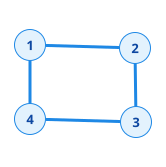

***Arête :***
&emsp; {1,2} 1->2 et 2->1

***Arc :***
&emsp; (a,b) a->b != (b->a)

***Boucle:***
&emsp; $\exist x \in V , \{x,x\} \text{ ou } (x,x) \in E$

***Graphe simple :***
&emsp; Graphe sans arête parallèle

## Motivation

- Outils pour modéliser des problèmes de la vie réelle
- Outils théoriques puissants
- Minimisation de caméras (pour une galerie d'art)

## Approche

- Vision algébrique
- Mathématique discrète<br>Trouver des condition nessecaire et suffisante pour l'existence d'un objet

## Algorithme de résolution

Représentation d'un graphe:

- Matrice d'adjacence
- Liste d'adjacence

### Matrice d'adjacence

Dans un graphe à $n$ sommet l'espace mémoire utilisé est en $O(n^2)$  
Le nombre max d'arêtes est de $\frac{n(n-1)}{2}$ il s'agit d'un graphe complet

### Liste d'adjacence

Liste de listes des voisins

1->[2]  
2->[3,1,4]  
3->[4,2]  
4->[3,2]  

$$
d_G(x) = \left|\{w \mid \{w, x\} \in E(G)\}\right|
$$

**Ex:** 

$d_G(2)=3,d_G(1)=1,d_G(3)=2$

$$
n + \sum_{x \in V} d_G(x)
\\et\\
\sum_{x \in V} d_G(x) = 2m\\
\implies n+2m \in O(n+m)
$$

Dans un graphe orienté on distingue les voisins entrants et sortants  
On note:

- $d_G^+$ le nombre de voisins sortants 
- $d_G^-$ le nombre de voisins entrants

$$
S(G) = \min \left\{ d_G(x)\mid x \in V(G) \right\}\\
\Delta(G) = \max \left\{ d_G(x)\mid x \in V(G) \right\}\\
N_G(v) =  \left\{w \mid \left\{v,w\right\} \in V(G)\right\}
$$

On dit qu'un graphe est  $k$-régulier si tous les sommets ont des degrés identiques 

## Chemins et Cycles

**Chemins :**
$P = (v_1,v_2,v_3,...,v_k), \forall{i} \in{[1,k-1]},v_i \neq v_{i+1} \text{ et } {v_i,v_{i+1}}\in{E(G)}$

**Ex:** 

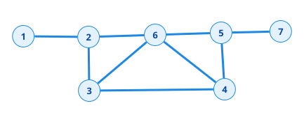

- $P_1 = (1,2,\bold{6},3,4,\bold{6},5,7)$ n'est pas un chemin élémentaire car il y a 2 $\times$ le sommet 6
- $P_2 = (1,2,3,4,5,7)$ est un chemin
- $P_3 = (1,2,6,7)$ n'est pas un chemin élémentaire car l'arête {6,7} n'existe pas dans le graphe

**Cycles :**
&emsp; Un cycle est un chemin et $\{v_1,v_k\} \in{E(G)}$

## Famille de graphe particuliere

### Graphe en etoiles

$K_{1,n}$ un sommet dominant $n$ sommets

### Foret et Arbre

**Foret :**  
&emsp; Graphe sans cycle

**Arbre :**  
&emsp; Graphe connexe acyclique

**Connexe :**  
&emsp; $G=(V,E)$ est connexe si $\forall$ paire de sommet $\exist$ un chemin qui les relies.  

Si le graphe n'est pas connexe on peut partitioner l'ensemble des sommets de $G$ en composantes connexe

$C \subseteq V(G)$ est une composante connexe si le sous graphe Induit epar $C$ est connexe et est un ensemble maximal.

La partition en composant connexe est unique.

Pour n'importe quel graphe à $n$ sommets , le nombre de composante connexe esst au plus $n$.  
Nombre min = 1 $\implies$ le graphe est connexe 

> Etoile $\subseteq$ Arbre $\subsetneq$ Foret $\subsetneq$ Bipartie

### Graphe Bipartie

$G=(V,E)$ est un graphe bipartie $ssi$ on peut partitioner $V$ en deux parties $A$ et $B$ de telle facon que chaque arête $e$ ait une extremité dans $A$ et l'autre dans $B$.

**Ex:**

- Graphe bipartie
  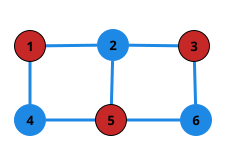
- Graphe non-bipartie
  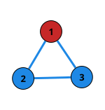

#### Stables/Ensemble independants

Noté $I_n$ graphe à $n$ sommets sans aucune arrete.  
Un graphe est bipartie $ssi$ il peut être partitioné en deux stables.

### Sous graphe/Graphe partiel

$H=(W,F),W\subseteq V \text{ et } F \subseteq E$  
Pour obtenir $H$ on peut supprimer de $V$ des sommets et des arêtes.

### Sous graphe induit

$H=(W,F), W\subseteq V \space F= E \cap (W,W)$  
On garde toutes les arêtes de $E$ qui ont leur 2 extremite dans $W$.

**Notation :** $H=G[W] \space H$ est le sous graphe induit par $W$ et $G$ 

$G$ est Bipartie $ssi$ $G[A]$ et $G[B]$ induisent des stables

### Sous graphe couvrant

Soit $G(V,E)$ un graphe et $H(W,F)$ un sous graphe de $G$.  
$H$ est couvrant (pour $G$) $si$:

- $W=V$
- $H$ est connexe

### Graphe complementaire

$G=(V,E)\space \bar{G} = (V,\binom{V}{2}\backslash E)$

$G :$ 
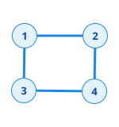
$\bar{G} :$
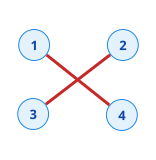

---

Deux graphes $G=(V,E)$ et $H=(W,F)$ sont isomorphes $ssi \space \exist$ une bijection $f : V \to W$ telle que :

$$
\forall (u, v) \in V^2, \quad (u, v) \in E \iff (f(u), f(v)) \in F
$$

---

# Graphe Biparti

**Remarques :** 

- Aucun cycle impair $(C_{2k+1})$ n'est biparti (ou : *Tous les cycles impairs ne sont pas bipartis*).
- Si $G$ contient un cycle impair comme sous-graphe, alors il n'est pas biparti.

**Théorème :** 

$$
\text{G bipartie} \iff \forall k \ge 1, \space C_{2k+1} \not\subseteq G
$$

Un graphe $G$ est biparti si et seulement si $G$ ne contient pas de cycle impair.

**Preuve:**

$\implies$ obvious  
$\impliedby$ SI $G$ ne contient pas de cycle impair alors tous les cylces sont de longeur paires

Soit $T$ un Arbre couvrant de $G$ pour determiner facilement une Bipartition des sommets $(A,B)$ pour toutes les arretes en suivant le procede d'Affectation de parties chaque arrete a une extreminter dans $A$ et l'autre dans $B$.  
On dois montrer que pour toute arrete $e \in G\backslash{T}$ a exactement une extremite dans $A$ et l'autre dans $B$.  
Tous les cycles sont de longeur paire et le graphe n'est pas bipartie $\implies \exists e \in G\backslash{T}$ tq sans pair de generalite que ses deux extremite sont dans $A$.

**Remarque :** Dans un arbre entre 2 sommet $x$ et $y$ $\exist !$ chemin qui les relie.

Il existe dans T un chemin de $x$à$y$. Si $x$et $y$ sont dans la meme partie $A$ cela signifie que le chemin qui relie $x$ à $y$ est de longeur paire.  
Si je concatene le chemin pair+ arrete $e$,j 'obtiens un cycle de longeur impair = contradiction.

**Marche :** chemin dans lequelle on peut avoir plusieur fois une arrete ou un noeud.

# Decomposition en cycle :

Une partition des arretes. $C=\{E_1,E_2,...,E_k\},\space E_i \subseteq E$

Chaque $E_i$ est un cycle

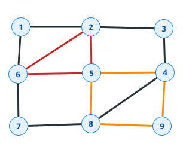

Ce graphe admet une decomposition en cycle.

**Lemme :** Si $G$ admet une decomposition en cycle, alors chaque sommet a degres pair.

**Preuve :**  
Pour chaque sommet $v$, on peut faire une liste de cycle $C^v_i$ auquel $v$ participe à un ou plusieur cycle et chaque cycle utilise exactement 2 arrete.  
Comme chaque arrete est couverte par exactement un cycle alors le nombre d'arrete est pair.

**Lemme :** Soit $G=(V,E)$ un graphe. Si $\delta(G) \geq 2$, alors $G$ contient au moins un cycle.

**Preuve :**  
Soit $P=(v_1,v_2,v_3,...,v_k)$ un chemin de longeur maximun.  
par hypothese $v_1$ et $v_k$ ont respectivement un autre voisin different de $v_2$ et resp $v_{k-1}$.  
L'autre voisin de $v_1$ est necessairement un sommet de $P \neq v_2$ on apelle ce voisin $v_j$ meme chose pour $v_k$ , un autre voisin $v_i \neq v_{k-1}$

**Def  :** Graphe $G$ est pair si tous les sommet ont un degres pair.

**Théoreme :** Un graphe $G$ admet une decomposition en cycle $\iff G$ pair.

**Preuve :**

$\implies$: Deja prouve dans l'avant dernier lemme.  
$\impliedby$: Par recurrence descendant

Soit $G^1 =G$  
On applique le lemme ($S(G) \geq 2$) pour trouve un cycle C  
On considere $G^2 = G\backslash E(C)$ et $G^2$ est pair.  
On réiter le procede sur les sommets de $G^2$ qui sont de degres non nul, donc $G^2$ est pair et $\delta(G) \geq 2$.  
On reitere les etapes. $G^i =$ trouve un cycle C de $G^{i-1}$,Supprimer $E(C)$ et les sommet de degres 0.  
Le procede s'arrete quand le graphe n'a plus aucun sommet.

**Lemme :** 

$$
\text{G connexe et } G \text{ admet un tour eulerien} \iff G \text{ est connexe et pair}
$$

**Preuve :**  
Comme le tour passe par toute les arretes, pour chaque sommet $v$ le tour arrive sur $v$ et reppart de $v$, le tour arrive autant de fois sur $v$ qu'il en repart de $v$ donc le degres est pair.

**Notation :**  
Si on a deux ensemble de sommets $X \text{ et } Y, \space e=(X,Y)$ esemble des arrete avec une extremite dans $X$ et l'autre dans $Y$. La coupe d'un ensemble $X$ noté $\delta(X) =$l'ensemble des arrete avec une extremite dans $X$ et l'autre dans $V\backslash X$  

## Algorithme de Fleury :

Input : $G=(V,E)$ pair  
Output : un tour eulèrien en u $\gets$ sommet de pair arbitraire

$w : = u$ // tour en construction  
$x := u$ Dernier sommet du tour  
$F :=G$ graphe couvrant

```
While deg_F(x) != None :
    Choisir = e={x,y} dans deg_F(x):
        e n'est pas deconnectante pour F sauf si c'est la seule disponible
        w = w . {x,y} , x := y
        F := F\{e}
    retrun w
```

$e =\{x,y\}$ est une arrete deconectante si el nombre de composante connexe de $G-e$ est strictement plus grande que celui de $G$

#graphe

**Theoreme :** L'algorithme de Fleury trouve toujour un tour Eulèrien si le graphe est pair

**Preuve :**
on veut montrer que $w$ est un tour Eulerien.

1. chaque arrete est utilise au plus 1 fois.
2. toutes les arrete sont utilise et qu'on revient au sommet de depart que l'on a choisis.

Pour 1 :  
Au depart $w$ est une marche et chaque arrete qu'on rajoute à la marche , on la supprime de $F$ donc on peut l'utilise d'une seul fois. La condition d'arret $\delta_F(X) = \empty$ à priori on s'arrete quand $x=u$

Pour 2 :  
Montrer par l'absurde que toutes les arretes sont utilisées.  
L'algorithme s'arrete et il reste des arretes de $G$ qui ne participent pas à $w$  
Soit X l'ensemble des sommets de degres positif de $F$ quand l'algorithme s'arrete.  
$F[X]$ est un graphe pair, on a $V\backslash X \neq \empty$ car $u \notin X$  
Comme le graphe de depart $G$ est connexe on a $\delta_F(X) \neq \empty$, la derniere arrete $e'$ de $\delta_F(X)$ qui à ete ajoute à $w$ le tour en construction dans le graphe a l'etape ou elle a ete choisie, elle est deconectante pour $F$.  
Ca contredit le choix imposé par l'algorithme qui aurait du choisir une autre arrete incidente à $x$ dans $F$ donc contradictoire.

$$
\text{Decomposition en cycle } \iff G \text{ est pair } \iff \text{Tour Eulerien}
$$

# Parcours de graphe :

## Parcours Generique :

Input $G=(V,E)$ ; $s$ sommet de depart  
Output $\sigma : V\to \N$

```
int i=1
ajouter s à L
While L != None
    v un elem de L
    L=L-{v}
    sigma(v)=i
    i++
    foreach w dans N_G(v) do
        si w jamais rencontre
            L=L union {u}
return sigma
```

## Parcous en Largeur:

Input : $G=(V,E)$ un graphe ;$s$ un sommet de depart  
Output : $T$ un arbre enracine en $s$;$\sigma : V \to \N$ ordre total des sommets.

```
foreach v dans V(G) do
    l[v] = +inf
    p[v] = None
    sigma[v] = -1
    c[v] = Couleur
L={s} //Liste des sommet a traiter
c[s] = gris
l[s] = 0
int i = 1
while L != None do
    v = PremierElem(L)
    sigma[v] = i
    i++
    foreach w dans N_G(v) do
        if(c[w] == Blanc)then
            AjoutFin(L,w)
            c[w] = Gris 
            p[w] = 1
            l[w] = l[v]+1
    c[v] = Noir
return(p,sigma,l)
```

Permet de tester facillement si $G$ est bipartie  
Trouver les plus cours chemin

Complexite de l'algorithme est en $O(n+2m)$ avec $n$ le nombre de sommet et $m$ le nombre d'arrete.

Le *while* est executé exactement $n$ fois.  
Chaque iteration du while coute exactement $O(d_G(v))$  
La globalite des operation des differentes iteration sont :

$$
n+\sum_{v \in V(G)}d_G(v) = n+2m =O(n+m)
$$

**Calcul de distance avec le BFS :**

Notation longeur de PCC : $\sigma(u,v) $= nombre d'arete pour aller de $u$ à $v$. ($\sigma(u,u)=0$)

**Lemme :**

Soit $G=(V,E)$ un graphe et $s \in V(G);\space \forall \{u,v\}\in E(G)$ on a  
$\sigma(s,v) \leq \sigma(s,u)+1$

**Preuve :**

Si $s$ et $v$ pas voisin , ca veux dire que le plus court chemin qui va s de $s$ à $v$ passe necessairement par un des voisin de $v$.  
Si par contre $s$ et $v$ sont voisin , la longeur est 1 donc la propriete est verifie

**Lemme :**

Soit $G=(V,E)$ un graphe et $s$ un sommet de depart. A la fin de l'algorithme on a $l[v] >= \sigma(s,v)$.

**Preuve :**

Par reccurence sur le nombre de sommet inserer dans la liste  
Base : $l[s] = 0$ donc on a $l[v] >= \sigma(s,s)$  
Recurrence:  
Pour tous les sommet $v_j$ deja inserer dans al liste on a $l[v_j]\sigma(s,v_j)$  
On ajoute $v_i$ à la liste $(i>j);\space l[v_i]=1+l[v_{j'}]$  
par hypothese de recurence  
$l[v_{j'}] \ge \sigma(s,v_{j'})$  
$l[v_i] = 1 +l[v_{j'}] \ge 1+\sigma(s,v_{j'})\ge \sigma(s,v_i)$ (par le lemme precedent)
Donc $l[v_{j'}]\ge \sigma(s,v_i)$

**Lemme :**
Soit $G(V,E)$ un graphe et soient $(v_1,v_2,...,v_r)$ les sommets present dans la liste:

1. $l[v_{i}]\leq l[v_{i+1}];\space \forall \space 1\le i <r $
2. $l[v_{r}] \leq l[v_{1}]+1$

**Theoreme :**

Soit $G(V,E)$ un graphe , $s$ un sommet de depart à la fin du BFS on a $l[v] =\sigma(s,v); \forall v \in V(G)$

**Preuve :**

Par reccurence sur le nombre de sommet inserer dans la liste.

Base: $l[s] = \delta(s,s) = 0$   
Induction: Par l'absurde 

On suppose qu'il existe un sommet v pour lequel la propriete n'est pas verifie $l[s] \neq \delta(s,v)$  
Donc $l[v]> \delta(s,v)$  
On considere $v$ le premier sommet insere dans la liste pour laquel on a cet inegalite.  
Pour tous les sommets qui ont ete inserer avant , els sommet $w$ ont la propiete $l[w] = \delta(s,w)$  
On considere  le plus court chemin de $s$ à $v$.   
pour $u$, par el choix de $v$ on a $l[u] = \delta(s,u)$  
$\delta(s,v) = \delta(s,u) + 1$. Vrai car $\delta(s,v) > \delta(s,u)$.  
$l[v] > \delta(s,v) = \delta(s,u) +1 = l[u] +1$  
Donc $l[v] > l[u] +1$ au moment ou on supprime $u$ de la liste.

Si $v$ est de couleur blache $v$ n'a jamais ete mis dans une liste et comme $u$ et $v$ sont voisin, il devrait etre rajoute à la liste avec $p[v] = u$ et $l[v] = l[u] +1$ **Pas possible**.

Si $v$ est gris cela signifie que $v$ est deja dans la liste.  
Si $v$ est deja dans la liste quand on supprime $u$ il existe un sommet $z$ qui a été traite avant u, $(\sigma[z]<\sigma[u])$ $l[z] \leq l[u]$.  
Donc $l[v] = l[z] +1$  
On a $l[z]+1 \leq l[u] +1$  
Donc $l[v] \leq l[u] +1$ **pas possible non plus**

Si $v$ est noir $\sigma[v]<\sigma[u]$ on a donc $l[v] \leq l[u]$ **pas possible**.

## Parcours en Profondeur :

Input : $G =(V,E)$  
Output : Foret couvrante

```
foreach v dans V(G) do
    c[v] = blanc
    p[v] = None
int date = 0
foreach u dans V(G) do
        if c[u] == blanc then
            Visiter PP(u)
```

```
Visiter PP(u){
    c[u] = gris
    date ++
    d[u] = date
    foreach (u,v) dans E(G) do
        if(c[v] == blanc) then
            p[v] = u
            Visiter PP(v)
    c[u] = noir
    date ++
    f[u] = date
}
```

Identifier les composante connexe

Composante fortement connexe (Graphe oriente)

Chaque sommet est traite exactement une fois.  
L'appel recursiff pour chauqe sommet est execute une seule fois.  
Donc le cout total des different appel recursif est borné par $n+2m$.

Donc $O(n+m)$

#exemple 

Pour chaque sommet $v$ on peut definir en intervalle $I_v = [d[v],f[v]]$.

**Théoreme :** $\forall$ paires de sommet $u$ et $v$ on a exactement une des 3 condition qui est verifie :

- $I_u$ et $I_v$ sont disjoint

- $I_u \subsetneq I_v$

- $I_v \subsetneq I_u$

**Preuve :**

$d[u] < d[v]$

Nous devons considere deux cas :

1. $d[v]<f[u]$

2. $d[v]>f[u]$

Cas 1 : $v$ a ete explorer alors que $u$ etait gris.  
Comme $v$ a ete decouvert apres $u$; son traitement s'est terminé avant celui de $u$ donc  $f[v]<f[u]$

Cas 2: si $d[v]>f[u] \implies I_u << I_v$ ($I_u$ est completement a gauche de $I_v$ donc ils sont disjoint).

**Théoreme :**

Dans un parcours en profondeur $v$ est un descendant de $u$ ssi au moment ou on commence à traite $u$ il existe un chemin dans $G$ de $u$ à $v$ uniquement compose de sommet blanc.

Classement par les arc/arete :

1. Arc liaison : arc couvert par la relation de parente

2. Arc arriere $(u,v)$ Si $u$ est un descendant de $v$

3. Arc avant $(u,v)$ Si  $u$ est un ascendant de $v$

4. Arc Transverse : tout les autres arcs

## Tri topologique

Pour un graphe oriente sans circuit on veut trouver un ordre total des sommet  $\sigma: V \to  \N$ qui est une bijection.

$\forall (u,v)$ on a : $\sigma(u) < \sigma(v)$

ex: 

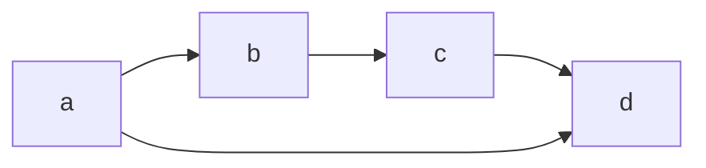
```mermaid
graph LR
a-->b
b-->c
c-->d
a-->d
```

Est un tri topologique.

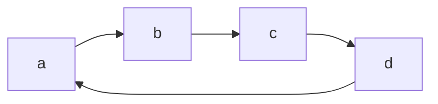
```mermaid
graph LR
a-->b
b-->c
c-->d
d-->a
```

Ne l'est pas.

**Théoreme :** Lors d'un parcours en profondeur d'un graphe non oriente, l'arc est soit un arc de liaison soit un arc arriere.

**Theoreme :** Un graphe orienté $D=(V,A)$ est sans circuit ssi lors d'un parcours en profondeur, il n'y a pas d'arc arriere.

**Preuve :**

$\implies$ : Par contrapose.  
Si $(u,v)$ est un arc arriere qui est génere lors du DFS, si $(u,v)$ est un arc arriere cela signifie que $u$ est un descendant de $v$. Alors il existe un chemin de $v$ à $u$, noté $P$.  
$P + (u,v)$ forme un circuit.

$\impliedby$: Par contrapose.  
Si $G$ contient un circuit $C$. Soit $v$ le premier sommet de $C$ qui a été découvert lors du DFS au moment de la decouverte de $v$ tous les sommets de $C$ sont de couleurs blanches. Par theoreme du chemin blanc, tous les sommets de $C$ sont des descendant de $v$. Je considere $u$ le sommet sur $C$ qui precede $v$.  
Donc $(u,v)$ est un arc du graphe et $u$ est un descendant de $v$ donc $(u,v)$ est un arc arriere.

### Algorithme de Tri Topologique

```
L = []
PP(G)
Lorsque le traitement d'un sommet v est termine on insere v 
au debut de L
Return L
```

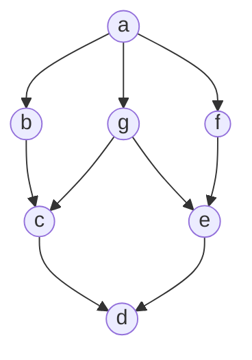
```mermaid
graph TD
    a((a)) --> b((b))
    a --> g((g))
    a --> f((f))

    b --> c((c))
    g --> c
    g --> e((e))
    f --> e

    e --> d((d))
    c --> d
```

On commence par g:

a,b,f,g,e,c,d

Complexite : Tri topo $O(n+m)$.  
L'ajout d'une insertion d'un sommet dans une liste se fait en $O(1)$.

**Preuve de correction :**

Pour tout arc $(u,v)$ on a $u$ qui a été insere dans la liste. On souhaite que $u$ apparaisse avant $v$ dans la liste $L : ...u...v...$.  
Donc $u$ a ete insere apres $v$ dans al liste (car on insere au debut).  
On doit montrer que pour tout arc $(u,v)$ on a $f[u] > f[v]$.  
Pour l'arc $(u,v)$ on se place sur $u$ au moment ou l'on considere l'arc $(u,v)$.  

- Si $v$ est gris alors $(u,v)$ est un arc arrière Pas possible ou pas de circuit.

- Si $v$ est blanc, $v$ est un descendant de $u$ et le traitement de $v$ sera terminé avant celui de $u$ donc $f[u] > f[v]$.  

- Si $v$ est noir $v$ à deja une date de fin, on a $d[u] > f[v]$ donc $f[u] > f[v]$. 

## Composante Fortement Connexe

un graphe $D=(V,A)$ est fortement connexe si pour toutes paires de sommet $(x,y)$, il existe un chemin qui va de $x$ à $y$ et de $y$ à $x$.

### Algorithme CFC

Input $G=(V,A)$

Output $p$[ ] arborescence couvrante.

1. $PP(G)$ (on calcule les date de fin pour chaque sommets)

2. calculer $G^T$ (on inverse le sens des arrete du graphe)

3. $PP(G^T)$ en commencant avec les sommet avec les plus grande date de fin.

4. return $p$[ ].

$G$ posède au moins 1 cc donc est fortement connexe. Et au plus n cc donc $G$ est un graphe sans circuit.

*Notation :* graphe des composante fortement connexe $G^{CFC}$.

chaque sommet represente une CFC de $G$. On met un arc de $C_i$ vers $C_j$ si il existe $(u,v) \in A(G) \space tq \space u\in C_i,\space v\in C_j$.

Remarque:  $G^{CFC}$ est sans circuit.

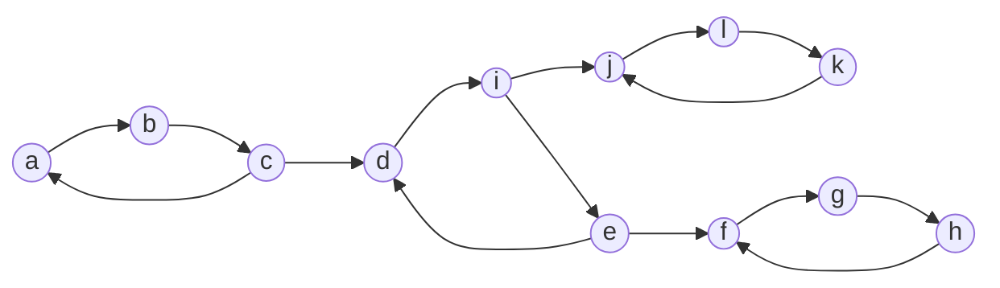
```mermaid
graph LR
    a((a)) --> b((b))
    b --> c((c))
    c --> a

    c --> d((d))
    d --> i((i))
    i --> e((e))
    e --> d

    i --> j((j))
    j --> l((l))
    l --> k((k))
    k --> j

    e --> f((f))
    f --> g((g))
    g --> h((h))
    h --> f
```

{a:24;b:23;c:22;...}

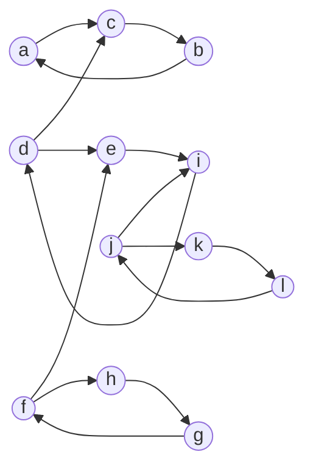
```mermaid
graph LR
    a((a))
    b((b))
    c((c))
    d((d))
    e((e))
    f((f))
    g((g))
    h((h))
    i((i))
    j((j))
    k((k))
    l((l))

    a --> c
    b --> a
    c --> b


    d --> c
    i --> d
    e --> i
    d --> e

    j --> i
    l --> j
    k --> l
    j --> k

    f --> e
    g --> f
    h --> g
    f --> h
```

# Couplage dans les graphes.

**Def :**

Soit $G=(V,E)$ un couplage $M$ de $G$ est un emseble d'arrete.  
$e_1,e_2,...,e_k$ on a $V(e_i)\cap V(ej)\neq \empty$

On cherche a trouve un couplage.  
On notera $\alpha'(G)$ la taille du couplage maximum.  
$M_2$ est maximun car $|M_2|=3$.  
Chaque arrete du couplage couvre 2 sommets, le couplage $M_2$ couvre tout les sommets.

Un couplage est dit parfait si tous les sommets sont couverts par le couplage.

Parfait $\implies$ Maximum.

Soit $G$ un graphe et M un couplage. Un chemin $P$ est $M$-alternant si il utilise alternativement une arrete de $M$ et une Arete du graphe.

Cycle alternant : un cycle avec 1 arrete sur 2 dans $M$.(cycle pair).

Un chemin est $M$-alternant si la premiere arete et la derniere arrete de $P$ n'appartient pas à $M$.  
On a un nombre plus important d'arrete de $P$ qui ne sont pas dans $M \to$ Le nombre d'arrete est impair.

$M=\{b,c\}$

$P=\{\{a,b\},\{b,c\},\{c,d\}\}$. 
$P$ est un chemin M Augmentant.

En inversant les arrete de M et les arrete qui appartient pas à $M$, On obtient un nouveau couplage de $M$.

$|M'|>|M|$ quand on augmente le long d'un chemin augmentant $|M'|=|M|+1$.

**Theoreme :**
Soit $G=(V,E)$ un graphe et $M$ un couplage.  
$M$ est maximum ssi $G$ n'admet pas de chemin $M$-augmentant.

**Preuve :**
$\implies$ Par contraposé :  
Si il existe un chemin $P$ qui est $M$-augmentant alors $M$ n'est pas Maximum. On construit $M^* = M \Delta P$ et on a $|M^*|=|M|+1$ donc $M$ n'est pas maximum.

$\impliedby$ Par l'absurde :  
Par l'absurde on suppose que $G$ n'a pas de chemin $M$-augmenetant et que $M$ n'est pas Maximum. Il existe $M^*$ un couplage maximum $|M^*|>|M|$.  
On vas considere le graphe $H[M \Delta M^*]$ (le graphe obtenue en gardant les arrete de $M$ qui ne sont pas dans $M^*$ et celle de $M^*$ qui ne sont pas dans $M$).  
Chaque sommet dans $H[M \Delta M^*]$ a degres au plus 2. Chaque composante connexe est soit un chemin soit un cycle de longeur paire(car autant d'arrete de $M$ que $M^*$).  
Les composante qui sont des chemins, il existe au moins une composante $C$ où $|C \cap M^*|> |C\cap M|$ car $|M^*|>|M|$, par le principe des tirroir et des chuasette , il existe un chemin $M$ augmentant.

Remarque : avec ce theoreme on peut deduire un algo.  
On part d'un couplage $M$ maximal.  
On applique le theoreme tant que c'est possible.  
Le probleme à resoudre et de trouve un chemin $M$-augmentant.

Couplage dans les graphes Bipartis $G=(X\cup Y,E)$.

Peut on trouve une condition necessaire et suffisante pour couvrir tous les sommet de $X$?

**Theoreme (Hall 1935):**

Soit $G=(X,Y,E)$ un graphe bipartie, il existe un couplage qui couvre tous les sommet de $X$ ssi $\forall S \subseteq X$ on a $|N(S)|\geq|S|$

**Preuve :**

$\implies$ :  
Si il existe un couplage $M$ qui couvre tous les sommets de $X$.  
Si on considere n'importe quel sous ensemble $S$ de $X$ comme chause arrete de $X$ est couverte par une unique arrete de $A$.  
On peut associer à chaque sommet $x_i\in X$ un sommet $y_i \in Y$ de maniere unique donc au final on peut garantir que $|N(S)|\geq|S|$.