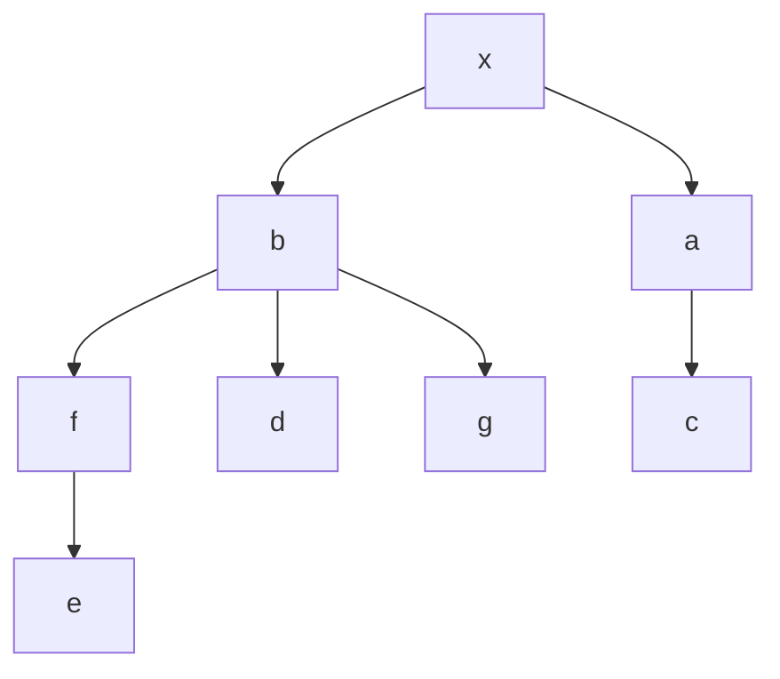

# Q1

Montrons que $cc(G+e) \leq cc(G)+1$.

Soit $e=\{x,y\}$ n'est pas une arrete deconnectente, alors le nombre de composante connexe reste le meme.

Sinon si $e=\{x,y\}$ est une arrete deconnectente, si $x,y \in C_i$ de $G$, $C_i$ partitioné en $C_i^x$ et $C_i^y$ car $x$et $y$ séparait la paire $a,b;\space a\in C_i^x \ et \ b\in C_i^y$. 

# Q2

Montrons par l'absurde qu' un graphe connexe pair ne possede pas d'arrete deconnectante.

$G$ pair et il existe $e=\{x,y\}$ deconectente.

Dans $G-e$:

- $\delta_{G-e}(x)$ est impair
- $\delta_{G-e}(y)$ est impair

$\delta_{G}(C_x)$ est impair et c'est le seul sommet de degres impair : Contradiction(ex2 TD1)

Pair $\implies$ decomposition en cycle $\implies$ au plus $\delta(v)/2$ cycle (car 1 entre associe a une sortie)

comme cycle alors si on supprime le noeud , on supprime 1 chemin de $x$ à $y$ mais il y en minimum 1 restant. Donc $G$ est connexe.

Donc il y a au plus $\delta(v)/2$ composante connexe.

# Q3

$G=(V,E)$ pair, $\exists \mathcal{C}=\{C_1,C_2,...,C_k\}$ une decomposition en cycle $\mathcal{C}$.

chaque sommet $v$ appartient à $\delta_g(v)/2 cycles.$

# Q4

contre exemple

# Q6

$\{b,a\} \to \{a,f,d,g\} \to \{f,d,g,c\} \to \{d,g,c,e\} \to\{\}$ 

resultat : [x,b,a,f,d,g,c,e]

