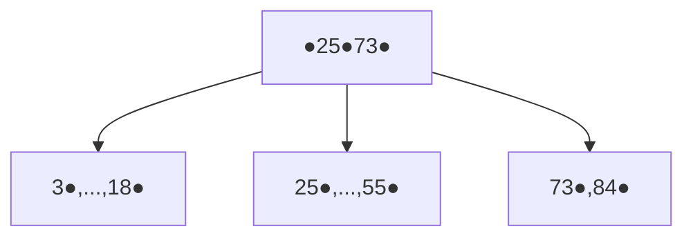
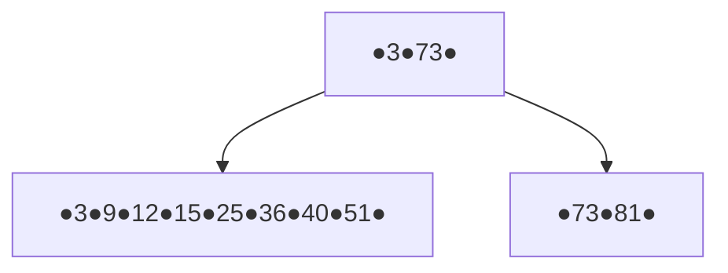
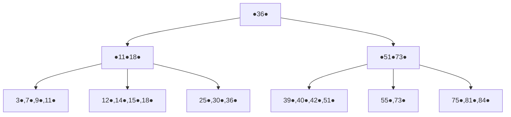

# Exercice 1:

## Q1

Ici le dernier etage et dense, les cles pointent donc vers un **enregistrement**

## Q2

Ici le dernier etage et non-dense (intervalle), les cles pointent donc vers un **bloc ordoné**

## Q3

# Exercice 2:

## Q1

$\frac{4\ 096}{45}=91$ il y a 91 enregistrement par blocs. (cela est du  au fait qu'il n'y est pas de chevauchement)

$\frac{1\ 000\ 000}{91}=10\ 990$ il faut donc 10 990 blocs pour tout stocker, soit  45 015 040 octets.

## Q2

Dans un bloc on peut stocker $\frac{4\ 096}{8+32}=102$  couples cles - adresses.

Il faut donc $\frac{1\ 000\ 000}{102}=9804$ blocs pour les feuilles.

Donc l'etage du dessus comporte 9 804 pointeur et 9 803 cle soit :$ 8 + 40 \times 9\ 803 =392\ 128$ octet soit 96 bloc + la racine .

L'index prend donc  $9\ 804 + 96 +1=9\ 901$ blocs.

## Q3

Dans un bloc on peut stocker $\frac{4\ 096}{8+4}=341$ couples cles - adresses.

Il faut donc $\frac{1\ 000\ 000}{341}=2933$ blocs pour les feuilles.

Donc l'etage du dessus comporte 2 933 pointeur et 2 932 cle soit :$ 8 + 12 \times 2\ 932 =35\ 192$ octet soit 9 bloc + la racine .

L'index prend donc $2\ 933 + 9 +1=2\ 943$ blocs.

## Q4

Si index  : racine + noeud interne + feuille + data = 4 bloc.

Si sans index : lire tout les bloc soit 10 990 bloc.